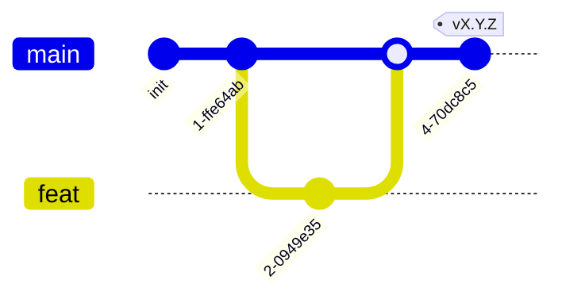

# AGENTS.md — правила работы в репозитории методологии

Основной документ для людей и программных агентов, которые изменяют
**методологию**. Он содержит обязательные правила работы: допустимые изменения,
ветвление, оформление коммитов, язык и проверку документов. Пошаговые процедуры
находятся в `docs/guide/`, канонические технические сведения — в `docs/refs/`.
Подбор документа по рабочей ситуации начинается с `docs/INDEX.md`.

> **Назначение репозитория.** Центральная методология микросервисной системы:
> процедуры по этапам (`docs/guide/`), канонические сведения (`docs/refs/`) и
> исходные шаблоны (`skeletons/`). Хаб, сервисы, пользовательские интерфейсы и
> автономные компоненты размещаются в отдельных репозиториях. Они не копируют
> `guide` и `refs`, а ссылаются на этот репозиторий. Он является корневым
> источником правил в модели связей `методология → хаб → сервисы`,
> `методология → интерфейсы`, `методология → автономные компоненты` (см.
> `docs/refs/VERIFICATION.md`, `docs/refs/TOPOLOGY.md`).

## Документация (приоритет)

В порядке убывания **по ярусам**: этот `AGENTS.md` → `docs/guide/` + `docs/refs/`
(**один ярус**: процедуры и факты) → `skeletons/` (стартовые наборы) → код.

`guide/` и `refs/` — **равны по приоритету**: это разные виды документа
(процедура vs факт), а не старшинство. `docs/INDEX.md` — роутер.

Приоритет **арбитражирует только между ярусами** (например, `AGENTS.md`
запрещает то, что `guide/` подразумевает — запрет побеждает; канон бьёт
устаревший скелет; канон бьёт код). Противоречие **внутри яруса** (в частности,
`guide/` против `refs/`) — **не арбитраж приоритетом**, а **дефект**: его чинят
правкой документа к одной правде (факт — в `refs/`, процедура — ссылается, не
дублирует). Сама методология — единый живой документ: эволюционирует коммитами,
**без ADR** для своих внутренних изменений (ADR — процедура для инстанцированных
репо: `docs/guide/60-adr.md`).

## Модель ветвления



- `main` — стабильная, единственная интеграция. Вливается из feature-веток
  через PR.
- `feat/<задача>` — от `main`, удаляется после merge.
- Прямой коммит в `main` — **запрещён**. Путь в `main` единственный и
  обязательный: **feature-ветка + PR + merge** (squash). Это не запрет на
  попадание изменений в `main`, а запрет на способ: нельзя коммитить в `main`
  напрямую, но влить PR в `main` — норма и ожидаемое действие. После создания
  PR его merge в `main` легитимен (не требует отдельного разрешения).
- **Релизы — тегами**, не ветками. Два уровня: **pre-release** — тег
  `vX.Y.Z-rc.N` (режется часто, как поток кандидатов);
  **стабильная** — тег `vX.Y.Z` без суффикса, помечается latest. Других
  pre-release-суффиксов нет (`beta` не используется). Release-ветки не
  заводятся. Процедура — `docs/guide/70-release.md`.

## Проверка перед коммитом

Прикладного кода здесь нет, поэтому обычные команды статического анализа,
тестирования и сборки не применяются. Вместо них выполняется **проверка
документов и шаблонов**. Заключение агента носит рекомендательный характер,
проверка в CI блокирует принятие изменений.

- **Ссылки разрешаются:** `docs/...md` и `skeletons/...` ссылки в
  `README`/`AGENTS`/`INDEX`/`guide/`/`refs/`/`skeletons/**` ведут на существующие
  файлы. Висячих указателей нет.
- **Нет дублирования фактов:** факт — один авторитет в `refs/`; в этапах `guide/`
  только инлайн-минимум. Сервис-rules — только в `skeletons/service/AGENTS.md`;
  правила работы над методологией — только здесь.
- **Идентичность корня:** в корне нет сервис-/хаб-артефактов
  (`ARCHITECTURE.md`/`specs/`/`docker-compose.yml`/`.env*` — в
  `skeletons/service/`; `BACKLOG.md`/`COMPOSITION.md`/`CONVENTIONS.md` — в
  `skeletons/hub/`).
- **Скелеты самодостаточны:** `skeletons/{service,hub,interface,stub}/` можно
  скопировать в новый репо и сразу работать; указатели `<methodology-repo>`
  осмысленны.
- **Самодостаточность процедур:** каждый документ `guide/N-*.md` понятен без
  чтения других этапов и применим в репозитории сервиса. Он содержит исходные
  условия, шаги, необходимый минимум технических сведений и ссылки на `refs/`.

Полная модель проверки приведена в `docs/refs/VERIFICATION.md`.

Исполняемый локальный гейт запускается той же командой, что CI:

```bash
uv run tools/verify/verify.py --report verification.json
```

Все репозитории применяют последнюю версию методологии. `.methodology.yml`
содержит только машинно-читаемые тип репозитория и версию своей схемы.

## Процедуры и факты

Роутер «ситуация → читай» — **`docs/INDEX.md`** (процедуры per-service в
`docs/guide/00..70`, факты в `docs/refs/`). Системные: `docs/refs/TOPOLOGY.md`
(репозитории), `docs/refs/COMMUNICATION.md` (общение микросервисов).

## Что можно

- Редактировать `docs/guide/` (процедуры), `docs/refs/` (факты),
  `docs/INDEX.md` (роутер), корневые `README`/`AGENTS` — с самодостаточностью
  фаз и без дублирования.
- Редактировать `skeletons/service/`, `skeletons/hub/`, `skeletons/interface/` и
  `skeletons/stub/` — синхронизировать со актуальной методологией.
- Создавать репозиторные скрипты и служебные инструменты только на Python;
  запускать их через `uv run`.
- Создавать feature-ветки, PR в `main`, теги `vX.Y.Z`.
- Заводить ADR-шаблоны в `skeletons/hub/adr/` (ADR — в хабе, единый дом программы).

## Что нельзя

- Коммитить напрямую в `main`; заводить `dev`/release-ветки.
- Дублировать факты (один факт — один авторитет в `refs/`) или правила
  (service-rules — только в `skeletons/service/AGENTS.md`).
- Отклоняться от usecase-структуры модуля (`docs/refs/MODULE.md`) — отклонение
  через ADR (`docs/guide/60-adr.md`), не тихим отступлением. (`MODULE.md`/`SPEC.md`
  применяются только к **сервису**; интерфейсу и автономному компоненту — нет.)
- Класть в корень сервис-артефакты (`ARCHITECTURE.md`, `specs/`,
  `docker-compose.yml`, `.env*`, `Dockerfile`) — их место `skeletons/service/`;
  хаб-артефакты (`BACKLOG.md`, `COMPOSITION.md`, `CONVENTIONS.md`) — их место
  `skeletons/hub/`.
- Хранить в `skeletons/` код приложения или lock-файлы — только стартовые
  файлы и шаблоны.
- Создавать репозиторные скрипты и обвязки на shell или PowerShell (`*.sh`,
  `*.ps1`); для них используется Python с запуском через `uv`.
- Вводить прямую service-to-service связность в обход брокера в `refs/` и в
  `skeletons/hub/CONVENTIONS.md` — только через брокер (`docs/refs/COMMUNICATION.md`).
  browser-facing presentation-эндпоинты (HTTP/WS для интерфейсов) — только на
  **gateway-сервисе**; прочие сервисы их не держат (модель — `COMMUNICATION` →
  *Сервис-шлюз*).
- Трогать lock-файлы, `.env` без одобрения.
- Выдавать stub за реализацию — честно помечать placeholder/TODO.

## Коммиты

Коммиты оформляются по соглашению Conventional Commits. Допустимые области
изменений: `guide`, `refs`, `skeletons`, `docs`.

```
feat(refs): add COMMUNICATION reference (broker, envelope, pin)
fix(skeletons): align service AGENTS with verification gate
docs(guide): clarify "в репо сервиса" in phase 30
chore: bump template version
```

Несовместимое изменение обозначается строкой `BREAKING CHANGE:` в теле коммита.

## Язык

Документация — русский. Смена языка проекта — отдельное решение с переводом
всех доков, не по-файлово. Английский — только для идентификаторов кода, имён
модулей, `Status:` в ADR, summary-строки коммита.
