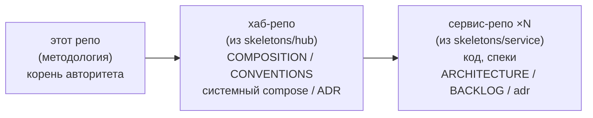

# AI Microservice Methodology

[](#)
[](LICENSE)
[](LICENSE-DOCS)

**Центральная методология построения микросервисного проекта.** Читается как
пошаговый гайд и служит первоисточником правил для хаба и сервисов. Это **не код
приложения** и **не один микросервис** — это методология того, **как** строить
систему из хаба и сервисов. Хаб и сервисы инстанцируются из `skeletons/`
отдельными репо и ссылаются сюда за правилами, **не копируя** их к себе.

## Что здесь

- **`docs/guide/`** — процедуры-плейбуки по фазам (bootstrap → … → release).
  **Пошаговые и модульные:** каждая фаза самодостаточна, читается одна.
- **`docs/refs/`** — авторитетные факты (одна правда, без дублирования).
  Системный уровень: `TOPOLOGY` (структура репозиториев), `COMMUNICATION`
  (общение через брокер, event envelope, пин контрактов), `VERIFICATION`
  (verification gate, edge-модель). Per-service: `STACKS` / `LAYOUT` / `MODULE`
  (внутренняя архитектура модуля) / `DEPLOYMENT` / `SPEC`.
- **`skeletons/service/`** — стартовый набор сервис-репо. Копируется → новый репо.
- **`skeletons/hub/`** — стартовый набор хаб-репо (`COMPOSITION`, `CONVENTIONS`,
  системный `docker-compose.yml`, `adr/`). Копируется → хаб-репо.
- **`AGENTS.md`** — правила работы над **самой методологией** (ветвление,
  docs-verify, можно/нельзя).
- **`docs/INDEX.md`** — роутер «ситуация → читай».

## Модель



- **Этот репо** — корень авторитета, не инстанцируется как сервис, не содержит
  кода приложения. Хаб/сервисы ссылаются на `docs/guide/` и `docs/refs/` здесь.
- **Хаб-репо** хранит системные контракты (`CONVENTIONS@vN`) и состав программы
  (`COMPOSITION`); сервисы пинят версию, гейт проверяет сервис против пина.
- **Сервис-репо** — клиент брокера (одного на систему: Kafka/Redpanda/NATS),
  один стек (Python/Go/Rust/TS), деплой контейнером; внутри — workspace модулей.

Edge-модель верификации (`методология → хаб → сервисы`) — `docs/refs/VERIFICATION.md`;
топология репозиториев — `docs/refs/TOPOLOGY.md`.

## Как пользоваться

**Построить систему:** 1) скопируй `skeletons/hub/` → хаб-репо; 2) заполни
`COMPOSITION`/`CONVENTIONS`, выбери брокер в системном compose; 3) на каждый
сервис скопируй `skeletons/service/` → новый репо, выбери стек
(`docs/guide/00-bootstrap.md`), заполни `ARCHITECTURE` (фаза 10), спеки (фаза 20),
работай по фазе 30; 4) стабильные версии — тегами `vX.Y.Z` (фаза 70).

**Разобраться в методологии:** открой `docs/INDEX.md` (роутер «ситуация → читай»);
системный уровень — `refs/TOPOLOGY`, `refs/COMMUNICATION`; per-service цикл —
фазы `guide/00..70`.

## Разработка (в репозитории методологии)

```bash
git checkout main && git pull && git checkout -b feat/<задача>
# правка guide/refs/skeletons; docs-verify перед коммитом — AGENTS.md
git commit -m "docs(guide): ..." && git push   # PR в main
```

Прямой коммит в `main` запрещён; интеграция — только PR. Стабильные версии —
тегами `vX.Y.Z` (`docs/guide/70-release.md`). Подробно — `AGENTS.md`.
Команды запуска сервисов/хаба — в **инстанцированных** репо (там есть код и
`Dockerfile`); в этом репо их нет.

## Лицензия

- Код (скелеты, конфиги): [MIT](LICENSE)
- Документация: [CC BY 4.0](LICENSE-DOCS)