# Методология разработки с ведущей ролью агентов

Лёгкая специализированная методология для событийных систем, одного живого разработчика и
программных агентов. Она предполагает обмен между сервисами через брокер и не является
универсальным шаблоном для произвольной распределённой или синхронной архитектуры. Человек
ставит одну продуктовую задачу за раз и видит результат в тестовой среде; анализ,
код, тесты, независимую проверку, слияние и развёртывание в тестовой среде выполняют агенты.

## Начать

1. Прочитать [`docs/START.md`](docs/START.md) — модель целиком за один присест.
2. Формулировать задачи по шаблону из
   [`docs/REFERENCE.md`](docs/REFERENCE.md).
3. Для выполнения задачи следовать [`docs/WORKFLOW.md`](docs/WORKFLOW.md).

[`docs/INDEX.md`](docs/INDEX.md) направляет к трём условным справочникам:
архитектуре, эксплуатации и кратким таблицам.

## Состав

- `docs/` — шесть коротких документов методологии;
- [`skeletons/`](skeletons/README.md) — выбор и стартовые наборы хаба, сервиса,
  интерфейса и автономного компонента;
- `tools/verify/` — локальная проверка и проверка в CI;
- `tools/pipeline/` — исполнитель стадий продуктового конвейера;
- `tools/review/` — независимый Strands reviewer с Ollama или OpenAI-совместимым API;
- `tools/tasks/` — генерация машинных задач из канонического `BACKLOG.md`;
- `schemas/` — машинные форматы отчётов.

## Основной цикл

```mermaid
flowchart LR
    backlog[BACKLOG] --> implementation[Реализация]
    implementation --> policy[Проверка правил]
    policy --> lint[Статический анализ]
    lint --> tests[Тесты]
    tests --> review[Независимая проверка]
    review --> build[Сборка]
    build --> artifact[Артефакт]
    artifact --> merge[Слияние]
    merge --> deploy[Развёртывание]
    deploy --> done[Готово]
```



Глобальных локов и статуса `[~]` нет: одновременно выполняется только одна
задача. Кандидат в выпуск создаётся по необходимости, а не после каждого слияния.

## Проверка методологии

```bash
uv run tools/verify/verify.py --report verification.json
```

Продуктовые изменения идут через `feat/<задача>` и PR в `main`; обслуживание
этого репозитория выполняется по отдельным правилам `AGENTS.md`. Прямой коммит в
`main` запрещён. Если публикация явно не запрещена, агент сам отправляет
рабочую ветку, открывает PR, дожидается обязательных проверок, выполняет слияние со свёрткой коммитов и
синхронизирует локальный `main` по правилам `docs/WORKFLOW.md`. Код
распространяется по MIT, документация — CC BY 4.0.
