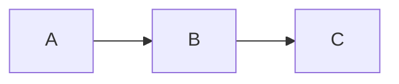
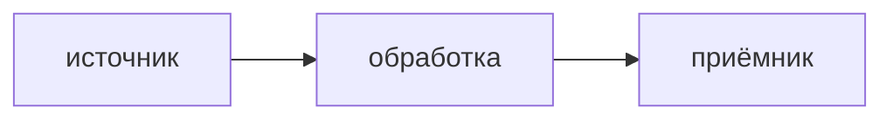

# Архитектура

> Это скелет-плейсхолдер одного микросервиса. Стек выбран в `docs/STACKS.md`,
> раскладка каталогов — в `docs/LAYOUT.md`. Заполни секции под свой сервис.
> Структура секций намеренно такая, чтобы её можно было читать и людям, и агентам.

## Что это

<!-- Один-два предложения: что за сервис, какую роль в системе играет. -->

## Что делает

<!-- Нумерованный список ключевых функций. -->

1. **<Глагол>** — кратко что делает и зачем.

## Чего не делает

<!-- Явные границы: что NOT in scope. Важно для агентов, чтобы не «помогали»
     там, где не надо. -->

- Не делает …

## Слои

<!-- Перечень модулей с однострочной ролью каждого. Модуль = каталог выбранного
     стека (см. LAYOUT.md) + отдельный спек в docs/specs/. -->

```
<модуль-A>   роль
<модуль-B>   роль
<модуль-C>   роль
```

Зависимости (DAG):



## Потоки данных

<!-- Главные потоки сервиса (входящие/исходящие). Mermaid-схемы приветствуются. -->



### <Поток 1: имя>

<!-- Шаги потока с объяснением. -->

## Доверительная граница

<!-- Где проходит граница доверия, что по какую сторону, какие гарантии.
     Для сервисов без границ доверия — секцию можно убрать. -->

- …

## Ссылки

<!-- Внешние документы, хаб, ADR. -->

- `docs/adr/` — архитектурные решения.