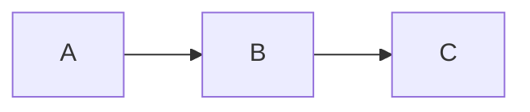
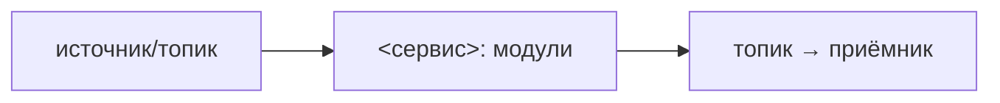

# Архитектура

> Скелет одного микросервиса. Стек — `docs/refs/STACKS.md`, раскладка workspace'а —
> `docs/refs/LAYOUT.md`, деплой — `docs/guide/50-deploy.md` + `docs/refs/DEPLOYMENT.md`.
> Процедура заполнения — `docs/guide/10-architecture.md`. Заполни секции под свой
> сервис. Структура секций читается и людьми, и агентами.
>
> Состав программы (несколько сервисов, системная топология) — в хабе
> `COMPOSITION.md`. Здесь — только этот сервис и его граница с системой.

## Что это

<!-- 1–2 предложения: что за сервис, какую роль в программе играет.
     Ссылка на хаб COMPOSITION.md для системного контекста. -->

## Что делает

<!-- Нумерованный список ключевых функций сервиса. -->

1. **<Глагол>** — кратко что делает и зачем.

## Чего не делает

<!-- Явные границы. Важно для агентов, чтобы не «помогали» там, где не надо. -->

- Не делает …

## Модули

<!-- Таблица модулей workspace'а. Каждый — каталог по layout стека + спека. -->

| Модуль | Роль | Публикует / Читает (топики) |
|---|---|---|
| `<module-a>` | … | publish: `…` / consume: `…` |
| `<module-b>` | … | … |
| `<module-c>` | … | … |

Зависимости между модулями (DAG):

## Брокер

<!-- Один брокер на систему (Kafka / Redpanda / NATS — зафиксируй). Сервис —
     его клиент. Формат сообщений — из хаба CONVENTIONS.md, не свой. -->

- **Брокер:** <Kafka | Redpanda | NATS>
- **Адрес (локальная разработка):** из `docker-compose.yml`, сервис `broker`.
- **Контракты хаба:** `CONVENTIONS@v<N>` — пин версии, по которой гейт
  проверяет сервис (см. `docs/refs/VERIFICATION.md`, процедура — `docs/guide/40-verify.md`).
  Бамп пина — отдельным PR.

Топики сервиса:

| Топик | Направление | Назначение |
|---|---|---|
| `<topic>` | publish / consume | … |

Формат сообщений (event envelope) — хаб `CONVENTIONS.md` (или `docs/CONVENTIONS.md`
в standalone).

## Потоки данных

<!-- Потоки этого сервиса через брокер (входящие/исходящие). -->

### <Поток 1: имя>

<!-- Шаги потока с объяснением. -->

## Доверительная граница

<!-- Где проходит граница доверия сервиса, что по какую сторону, гарантии,
     подпись/аутентификация если есть. Для сервисов без границ — секцию убрать. -->

- …

## Деплой

- Сервис — контейнер со своим `Dockerfile` (детали — `docs/refs/DEPLOYMENT.md`;
  запуск локально — `docs/guide/50-deploy.md`).
- Локальная разработка — `docker-compose.yml` (брокер + этот сервис).
- Системный compose (все сервисы вместе) — в хабе, не здесь.
- Соответствие хабу (на пиннённой версии контрактов) проверяется verification-гейтом —
  см. `docs/refs/VERIFICATION.md` (процедура — `docs/guide/40-verify.md`).

## Ссылки

- Хаб `COMPOSITION.md` — состав программы.
- Хаб `CONVENTIONS.md` — event envelope, кросс-сервисные конвенции.
- Хаб `adr/` — архитектурные решения (или `docs/adr/` в standalone).