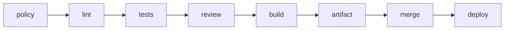

# Эксплуатация и выпуски

## Исполнимый продуктовый конвейер

Каждый продуктовый репозиторий содержит `.pipeline.json` и общую заготовку
`.github/workflows/verify.yml`. Конвейер выполняет строго блокирующую цепочку:



`tools/pipeline/run.py` запускает команды без командной оболочки: каждая команда
задаётся массивом исполняемого файла и аргументов. `build.outputs` перечисляет
созданные сборкой файлы или каталоги. Исполнитель упаковывает их в воспроизводимый
`product.zip`, стадия `artifact` фиксирует `sha256`, а `deploy` проверяет хеш,
распаковывает содержимое и выполняет заданные команды поставки. В командах допустимы
переменные `{commit}`, `{artifact}` и `{artifact_dir}`. Последними командами `deploy`
обязательно задаются проверка готовности и быстрая проверка тестовой среды.

Пример формы конфигурации:

```json
{
  "schema_version": 1,
  "lint": [["uv", "run", "ruff", "check", "."]],
  "tests": [["uv", "run", "pytest"]],
  "build": {
    "commands": [["uv", "build"]],
    "outputs": ["dist"]
  },
  "deploy": [["python", "tools/deploy.py", "{artifact_dir}", "{commit}"]]
}
```

Репозиторные инструменты поставки пишутся на Python. Маркеры `<...>` из заготовки
заменяются при первичной настройке; `VER-018` блокирует продуктовый PR при маркере,
невалидной конфигурации или нарушенном порядке стадий.

Стадия `review` принимает только актуальный `APPROVED` GitHub Review для текущего
коммита PR от учётной записи из `AGENT_REVIEWER_LOGIN`, отличной от автора PR.
Отправка нового коммита делает прежнее одобрение недействительным. Для метки
`risk:critical` дополнительно требуется актуальное одобрение отдельной учётной
записи из `HUMAN_REVIEWER_LOGIN`.

Стадия `merge` выполняет слияние со свёрткой коммитов и удаляет рабочую ветку только
после готового артефакта. Стадия `deploy` получает SHA созданного коммита слияния и
тот же артефакт. Обычная поставка использует среду GitHub `test`; PR с меткой
`risk:critical` использует защищённую среду `critical-test`, для которой обязательно
настраивается подтверждение человека перед развёртыванием.

Для работы конвейера задаются переменные репозитория `METHODOLOGY_REPOSITORY`,
`METHODOLOGY_VERSION`, `AGENT_REVIEWER_LOGIN` и `HUMAN_REVIEWER_LOGIN`, а при
необходимости секрет среды `DEPLOY_TOKEN`. До `merge` токен имеет только права
чтения; права `contents: write` и `pull-requests: write` получает только задание
слияния, а `deploy` получает `id-token: write`. В защите `main` обязательными делаются
`policy`, `lint`, `tests`, `review`, `build` и `artifact`; `merge` и `deploy` не
включаются в этот список, потому что первая сама выполняет слияние, а вторая работает
уже с его результатом. Прямой push в `main` остаётся запрещён.

## Развёртывание в тестовой среде

Каждое слитое изменение разворачивается в тестовой среде по SHA коммита или хешу артефакта.
Тег кандидата в выпуск для этого не нужен. Перед завершением задачи обязательны проверка готовности,
быстрая проверка и дополнительные проверки, выбранные по условиям задачи.

Минимальное свидетельство выполнения:

```yaml
task: TASK-0042
commit: abc1234
methodology: v1.0.0
checks:
  gate: passed
  review: passed
deployment:
  environment: test
  artifact: sha256:...
  smoke: passed
```

Свидетельство создаётся автоматикой, не содержит секретов и хранится как артефакт CI
или ссылка из результата задачи.

Один объект свидетельства по `schemas/evidence.schema.json` обязательно содержит
задачу, запуск CI, PR, коммит, точный `methodology_ref`, результаты обязательных и независимых проверок
с источниками, число попыток, хеш артефакта, проверки развёртывания, итоговый
статус, время создания и срок хранения. Для неприменимой проверки записывается
`not_applicable` с причиной. Независимая проверка содержит идентификатор проверяющего.

Свидетельство публикуется как неизменяемый артефакт CI `.evidence/TASK-NNNN.json`.
Хаб хранит канонический `BACKLOG.md`; одноимённая машинная задача
`.tasks/TASK-NNNN.json` является его автоматически сгенерированной проекцией. Средство проверки сверяет
всю запись с `BACKLOG.md`, связывает завершённую задачу со свидетельством и при наличии
параметров CI проверяет закреплённую ссылку на версию методологии и коммит. Свидетельство и указанные в
нём журналы доступны как минимум до `retained_until`; перезапись свидетельства для того
же запуска запрещена, исправление создаёт новый запуск.

## Эксплуатационный минимум

- Контейнер собирается в несколько этапов, запускается не от пользователя `root` и содержит только
  исполняемые артефакты и зависимости.
- Перед развёртыванием проходят `docker compose config`, сборка образа и проверка зависимостей
  и секретов.
- Компонент определяет проверки работоспособности и готовности, корректное завершение, структурированные журналы,
  идентификатор корреляции или трассировки, основные метрики и режим деградации.
- Потребитель определяет идемпотентность, повторные попытки с увеличением задержки, обработку ошибочных сообщений и
  DLQ.
- Внешние порты открываются только намеренно; клиентские порты принадлежат
  сервису-шлюзу.
- После развёртывания выполняются проверка готовности, быстрая проверка, применимые дополнительные проверки и окно
  наблюдения. Провал блокирует завершение задачи.

## Миграции данных

Изменение сохраняемых данных требует совместимого порядка развёртывания, резервной копии
или проверенного исправления вперёд, пробного запуска на сопоставимых данных и проверки старой
и новой версии приложения. Разрушающее удаление выполняется отдельной задачей
после периода совместимости.

## Откат

До развёртывания агент проверяет, что предыдущий хеш артефакта доступен и конфигурация с ним
совместима. Если откат данных небезопасен, используется исправление вперёд; это явно
фиксируется до слияния. Автоматический откат не выполняется при риске потери
данных.

## Стабильный выпуск

Стабильная версия выпускается только отдельной задачей человека. Агент:

1. проверяет успешные проверки `main` и тестовую среду;
2. определяет semver по накопленным изменениям;
3. создаёт аннотированный тег `vX.Y.Z`;
4. публикует примечания к выпуску и хеши поставляемых артефактов;
5. выполняет действия в эксплуатационной среде только в пределах разрешённой автономности.

`vX.Y.Z-rc.N` используется только когда действительно нужен формальный кандидат.
Ветки выпусков не создаются.

## Сбой автоматизации

Агент сверяет задачу, PR, коммит, запуск CI и хеш развёрнутого артефакта. Если состояние можно
однозначно восстановить, он продолжает с последней доказанной зелёной стадии.
Повторное выполнение необратимого шага без идемпотентности запрещено. Если состояние
неоднозначно, задача получает `automation-failed` и передаётся человеку.
