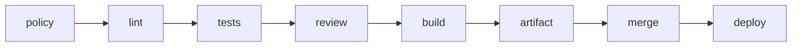

# Эксплуатация и выпуски

## Исполнимый продуктовый конвейер

Каждый продуктовый репозиторий содержит `.pipeline.json` и общую заготовку
`.github/workflows/verify.yml`. Конвейер выполняет строго блокирующую цепочку:



`tools/pipeline/run.py` запускает команды без командной оболочки: каждая команда
задаётся массивом исполняемого файла и аргументов. `build.outputs` перечисляет
созданные сборкой файлы или каталоги. Исполнитель упаковывает их в воспроизводимый
`product.zip`, стадия `artifact` фиксирует `sha256`, а `deploy` проверяет хеш,
распаковывает содержимое и выполняет заданные команды поставки. В командах допустимы
переменные `{commit}`, `{artifact}` и `{artifact_dir}`. Последними командами `deploy`
обязательно задаются проверка готовности и быстрая проверка тестовой среды.

Пример формы конфигурации:

```json
{
  "schema_version": 1,
  "lint": [["uv", "run", "ruff", "check", "."]],
  "tests": [["uv", "run", "pytest"]],
  "build": {
    "commands": [["uv", "build"]],
    "outputs": ["dist"]
  },
  "deploy": [["python", "tools/deploy.py", "{artifact_dir}", "{commit}"]]
}
```

Репозиторные инструменты поставки пишутся на Python. Маркеры `<...>` из заготовки
заменяются при первичной настройке; `VER-018` блокирует продуктовый PR при маркере,
невалидной конфигурации или нарушенном порядке стадий.

Стадия `review` принимает только актуальный `APPROVED` GitHub Review для текущего
коммита PR от учётной записи из `AGENT_REVIEWER_LOGIN`. Допускается та же учётная
запись, что и у автора PR; независимость обеспечивается отдельной сессией
агента-ревьюера.
Отправка нового коммита делает прежнее одобрение недействительным. Риск PR
обозначается меткой `risk:low`, `risk:medium`, `risk:high` или `risk:critical`.
Для всех уровней риска требуется `APPROVED` от `AGENT_REVIEWER_LOGIN`. Уровень
`risk:critical` не требует отдельного одобрения человека: строгость обеспечивают
назначенные по триггерам проверки, проверенная стратегия восстановления и запрет
автоматической поставки в эксплуатационную среду.

### Запуск независимого reviewer

`tools/review/review.py` реализует отдельный Strands Agent. Он поддерживает нативный
поставщик `ollama` и поставщик `openai` для любого OpenAI-совместимого API. Настройки
загружаются из `tools/review/.env`; точный шаблон находится в
`tools/review/.env.example`. Значения окружения процесса имеют приоритет над файлом.
Файл `.env` не коммитится.

Токен модели `REVIEW_MODEL_API_KEY` и токен GitHub
`REVIEW_GITHUB_TOKEN` являются разными секретами. Для локальной Ollama токен модели
не нужен. GitHub-токен принадлежит учётной записи `AGENT_REVIEWER_LOGIN` с правами
`Contents: read` и `Pull requests: read and write`; это может быть та же учётная
запись, что и у автора PR — независимость обеспечивает отдельная сессия
агента-ревьюера, а не отдельная учётка. Её точный логин одинаково задаётся в
`REVIEW_GITHUB_REVIEWER_LOGIN` локального reviewer и `AGENT_REVIEWER_LOGIN`
продуктового репозитория.

Reviewer получает только замкнутые инструменты чтения текущего PR: описание, diff,
файл из точного head SHA и результаты GitHub checks. Модель не получает GitHub-токен,
произвольную командную оболочку, запись файлов или публикацию review. Обычный код
публикует `APPROVE` либо `REQUEST_CHANGES` только после проверки структурированного
результата модели. `REVIEW_MAX_DIFF_BYTES` и `REVIEW_MAX_FILE_BYTES` ограничивают
контекст; превышение требует уменьшить задачу, а не молча обрезать данные.

Первый запуск выполняется без публикации:

```bash
cp tools/review/.env.example tools/review/.env
uv run tools/review/review.py --repository owner/repository --pr 42 --dry-run
```

После проверки настроек один PR публикуется без `--dry-run`, а постоянное ожидание
готовых PR запускается командой:

```bash
uv run tools/review/review.py --watch
```

Reviewer начинает анализ только после успешных checks из
`REVIEW_REQUIRED_CHECKS`, по умолчанию `policy`, `lint` и `tests`. Итог привязывается
к точному head SHA. Новый коммит требует нового review; публикация вызывает событие
`pull_request_review`, после которого продуктовый конвейер продолжает `build`.

Стадия `merge` выполняет слияние со свёрткой коммитов и удаляет рабочую ветку только
после готового артефакта. Стадия `deploy` получает SHA созданного коммита слияния и
тот же артефакт. Поставка любого уровня риска использует среду GitHub `test` без
обязательного подтверждения человека.

Для работы конвейера задаются переменные репозитория `METHODOLOGY_REPOSITORY`,
`METHODOLOGY_VERSION` и `AGENT_REVIEWER_LOGIN`, а при
необходимости секрет среды `DEPLOY_TOKEN`. До `merge` токен имеет только права
чтения; права `contents: write` и `pull-requests: write` получает только задание
слияния, а `deploy` получает `id-token: write`. В защите `main` обязательными делаются
`policy`, `lint`, `tests`, `review`, `build` и `artifact`; `merge` и `deploy` не
включаются в этот список, потому что первая сама выполняет слияние, а вторая работает
уже с его результатом. Прямой push в `main` остаётся запрещён.

## Развёртывание в тестовой среде

Каждое слитое изменение разворачивается в тестовой среде по SHA коммита или хешу артефакта.
Тег кандидата в выпуск для этого не нужен. Перед завершением задачи обязательны проверка готовности,
быстрая проверка и дополнительные проверки, выбранные по условиям задачи.

Минимальное свидетельство выполнения версии 2:

```yaml
schema_version: 2
task_id: TASK-0042
methodology_ref: v2.0.0
deliveries:
  - repository: https://github.com/owner/repository
    run_id: "123456789"
    pr: https://github.com/owner/repository/pull/42
    commit: abc1234
    checks:
      - name: policy
        status: passed
        source: https://github.com/owner/repository/actions/runs/123456789
    reviews:
      - name: independent
        status: passed
        source: https://github.com/owner/repository/pull/42#pullrequestreview-1
        reviewer: agent-reviewer
    attempts: 1
    artifact: sha256:0123456789abcdef0123456789abcdef0123456789abcdef0123456789abcdef
    deployment:
      environment: test
      probes:
        - name: smoke
          status: passed
          source: https://github.com/owner/repository/actions/runs/123456789
status: passed
created_at: 2026-01-01T00:00:00Z
retained_until: 2026-04-01T00:00:00Z
```

Свидетельство создаётся автоматикой, не содержит секретов и хранится как артефакт CI
или ссылка из результата задачи.

Один объект свидетельства версии 2 по `schemas/evidence.schema.json` обязательно
содержит задачу, точный `methodology_ref`, непустой массив `deliveries`, итоговый
статус, время создания и срок хранения. Каждая поставка содержит репозиторий,
запуск CI, PR, коммит, результаты обязательных и независимых проверок с источниками,
число попыток, хеш артефакта и проверки развёртывания. Репозиторий встречается в
массиве ровно один раз, а множество репозиториев точно совпадает с целевыми
репозиториями задачи. Для неприменимой проверки записывается `not_applicable` с
причиной. Независимая проверка содержит идентификатор проверяющего. Статус `passed`
допустим, только если каждая поставка содержит успешные обязательную, независимую
и послеразвёрточную проверки.

Свидетельства версии 1 продолжают читаться для уже завершённых однорепозиторных
задач, но новые и исправленные свидетельства создаются только в версии 2.

После успешной поставки свидетельство сохраняется в `.evidence/TASK-NNNN.json`
хаба одним служебным PR `task-finalization`. Оно содержит поставки всех целевых
репозиториев и SHA их коммитов слияния; исходные журналы CI остаются доступны по
полям `source`. Хаб хранит канонический `BACKLOG.md` как единственный источник
задач; машинная проекция не используется. Средство проверки связывает завершённую
задачу из `BACKLOG.md` со свидетельством и при наличии параметров CI проверяет
закреплённую ссылку на версию методологии и коммит. Свидетельство и указанные в
нём журналы доступны как минимум до `retained_until`; перезапись свидетельства для того
же запуска запрещена, исправление создаёт новый запуск.

`task-finalization` разрешён только после успешной поставки и может менять лишь
`BACKLOG.md` и одно свидетельство `.evidence/`.
Для совместимости с защитой ветки именованные продуктовые проверки возвращают
`not_applicable`; исполняется только `policy`, после чего PR сливается без сборки,
поставки и создания свидетельства о самой финализации.

Служебный PR с меткой `task-qualification` предшествует продуктовой реализации и меняет
только `BACKLOG.md`: атомарно добавляет риск, автономность, триггеры и откат к
одной первой задаче `[ ] ready`. Он также исполняет только `policy`; остальные
именованные продуктовые проверки возвращают `not_applicable`, продукт не
собирается и не развёртывается.

## Эксплуатационный минимум

- Контейнер собирается в несколько этапов, запускается не от пользователя `root` и содержит только
  исполняемые артефакты и зависимости.
- Перед развёртыванием проходят `docker compose config`, сборка образа и проверка зависимостей
  и секретов.
- Компонент определяет проверки работоспособности и готовности, корректное завершение, структурированные журналы,
  идентификатор корреляции или трассировки, основные метрики и режим деградации.
- Потребитель определяет идемпотентность, повторные попытки с увеличением задержки, обработку ошибочных сообщений и
  DLQ.
- Внешние порты открываются только намеренно; клиентские порты принадлежат
  сервису-шлюзу.
- После развёртывания выполняются проверка готовности, быстрая проверка, применимые дополнительные проверки и окно
  наблюдения. Провал блокирует завершение задачи.

## Миграции данных

Изменение сохраняемых данных требует совместимого порядка развёртывания, резервной копии
или проверенного исправления вперёд, пробного запуска на сопоставимых данных и проверки старой
и новой версии приложения. Разрушающее удаление выполняется отдельной задачей
после периода совместимости.

## Откат

До развёртывания агент проверяет, что предыдущий хеш артефакта доступен и конфигурация с ним
совместима. Если откат данных небезопасен, используется исправление вперёд; это явно
фиксируется до слияния. Автоматический откат не выполняется при риске потери
данных.

## Стабильный выпуск

Стабильная версия выпускается только отдельной задачей человека. Агент:

1. проверяет успешные проверки `main` и тестовую среду;
2. определяет semver по накопленным изменениям;
3. создаёт аннотированный тег `vX.Y.Z`;
4. публикует примечания к выпуску и хеши поставляемых артефактов;
5. выполняет действия в эксплуатационной среде только в пределах разрешённой автономности.

`vX.Y.Z-rc.N` используется только когда действительно нужен формальный кандидат.
Ветки выпусков не создаются.

## Сбой автоматизации

Агент сверяет задачу, PR, коммит, запуск CI и хеш развёрнутого артефакта. Если состояние можно
однозначно восстановить, он продолжает с последней доказанной зелёной стадии.
Повторное выполнение необратимого шага без идемпотентности запрещено. Если состояние
неоднозначно, задача получает `automation-failed` и передаётся человеку.
