# Быстрый старт

## Для чего эта методология

Методология специализирована для событийных систем: независимые сервисы обмениваются
сообщениями через брокер, а синхронная клиентская граница сосредоточена в сервисе-шлюзе.
Она не заявляет универсальность для систем с иной моделью коммуникации.

Один человек определяет, **что** нужно сделать, и проверяет результат в тестовой
среде. Агенты уточняют технический план, пишут код и тесты, проверяют изменение,
сливают его и разворачивают. Одновременно выполняется только одна задача, поэтому
распределённые локи и координация параллельных исполнителей не нужны.

Главная цель — дать агентам достаточно автономности, не позволяя им выдумывать
продуктовые решения или обходить воспроизводимые проверки.

## Что делает человек

- ведёт упорядоченный `BACKLOG.md` в хабе;
- определяет, какие репозитории нужны системе, их количество, назначение и
  высокоуровневые границы;
- формулирует цель, наблюдаемый результат и существенные ограничения;
- отвечает, если без продуктового решения продолжить нельзя;
- смотрит результат в тестовой среде;
- отдельно ставит задачу на стабильный выпуск.

Человеку не нужно заранее выбирать реализацию, тесты, риск, способ отката или набор
агентских ролей: это квалифицирует исполнитель. Состав репозиториев и границы
между ними к техническим деталям реализации не относятся и остаются решением
человека.

## Что делают агенты

Агенты берут только первую задачу со статусом `[ ] ready`, работают в рабочей ветке, обновляют
код, тесты и документацию, запускают детерминированную обязательную проверку, выполняют
независимую проверку при необходимости, сливают PR с успешными проверками и разворачивают коммит в тестовой среде.

Основной цикл:

```mermaid
flowchart LR
    backlog[BACKLOG] --> ready[Проверка готовности]
    ready --> implementation[Реализация]
    implementation --> policy[Проверка правил]
    policy --> lint[Статический анализ]
    lint --> tests[Тесты]
    tests --> review[Независимая проверка]
    review --> build[Сборка]
    build --> artifact[Артефакт]
    artifact --> merge[Слияние]
    merge --> deploy[Развёртывание и быстрая проверка]
    deploy --> done[Задача выполнена]
```

Рабочий PR является достаточным признаком выполняемой задачи. Статус `[~]`,
блокирующий PR и отдельное резервирование задачи не используются.

## Инварианты

1. Агент не додумывает отсутствующее продуктовое решение.
2. Прямой коммит в `main` запрещён: только `feat/TASK-NNNN-*` и PR.
3. Воспроизводимая проверка сильнее мнения агента; обязательная проверка работает
   и при сбое запрещает продолжение.
4. Реализация, тесты и затронутая документация изменяются вместе.
5. Независимая проверка продуктового PR выполняется другим вызовом агента.
6. Замечание сначала пытаются опровергнуть, затем исправляют.
7. Повторы ограничены; после исчерпания агент останавливается с диагностикой.
8. `[x]` ставится только после слияния и успешной проверки в тестовой среде.
9. Опасные или необратимые действия требуют подтверждения человека.
10. Заглушка никогда не выдаётся за готовую реализацию.

Каждый репозиторий закрепляет точный тег или коммит методологии в
`.methodology.yml`; `latest` не считается воспроизводимой версией.

## Репозитории

- **Методология** — эти правила, заготовки и средство проверки.
- **Хаб** — состав системы, общие соглашения, `BACKLOG.md`, системный файл Docker Compose и
  редкие ADR.
- **Сервис** — код одного независимо поставляемого сервиса.
- **Интерфейс** — клиентское приложение.
- **Автономный компонент** — отдельная программа вне сервисного обмена.

Человек фиксирует необходимый набор репозиториев и назначение каждого в хабе.
Агент реализует задачу внутри этих границ; потребность в новом репозитории или
изменении назначения существующего является `needs-input`, а не техническим
решением агента. Подробности — [`ARCHITECTURE.md`](ARCHITECTURE.md).

## Куда дальше

- создать репозиторий из заготовки — [`skeletons/README.md`](../skeletons/README.md);
- выполнять задачу — [`WORKFLOW.md`](WORKFLOW.md);
- менять устройство системы — [`ARCHITECTURE.md`](ARCHITECTURE.md);
- развёртывать, мигрировать или выпускать — [`OPERATIONS.md`](OPERATIONS.md);
- найти команду или статус — [`REFERENCE.md`](REFERENCE.md).
