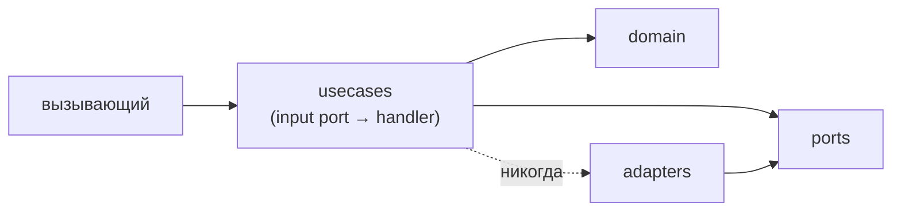

# Внутренняя архитектура модуля — справочник

Канон устройства **модуля изнутри** — usecase-driven архитектура с
фиксированными швами и направлением зависимостей. Модуль — уже определённая
единица (`docs/refs/LAYOUT.md`: один модуль = каталог стека + одна спека).
Здесь — как устроен код **внутри** этого каталога.

> Референс (факт «как устроен модуль внутри»). Процедура заведения модуля —
> пошагово в `docs/guide/20-define-module.md`. Канон структуры спеки —
> `docs/refs/SPEC.md`. Что проверяет гейт — `docs/refs/VERIFICATION.md`.

**Принцип:** фиксируются **швы и направление зависимостей**, не логика.
«Что» делает каждый юзкейс — в спеке (`SPEC.md`); «как» (тело handler) — на
усмотрение автора. Форма предсказуема и «запирается» структурным гейтом —
поэтому модуль легко редактировать и можно править **кусками**: один юзкейс
трогается без знания всего микросервиса.

## Швы (фиксированы)

- **`usecases/`** — поведение модуля, один юзкейс на единицу. Каждый юзкейс:
  - **input port** — контракт со стороны вызывающего: маленький интерфейс с
    одним входным методом (`execute(In) -> Out` / ошибки). Это публичный API
    модуля для этого юзкейса.
  - **handler/interactor** — единственная реализация input port. Оркестрирует
    domain + output ports. **Единственное место, где живёт «как».**
  - DTO входа/выхода — рядом с юзкейсом.
- **`ports/`** — **output ports**: интерфейсы, от которых зависит юзкейс
  (репозитории, публикатор в брокер, внешние клиенты). Определяются здесь,
  реализуются в `adapters/`. Без I/O.
- **`domain/`** — чистые доменные сущности/значения/правила. Без I/O, без ports.
- **`adapters/`** — реализации output ports (репо, брокер-адаптер, http-клиент).
  Здесь живёт I/O.

## Направление зависимостей (инвариант)

- `usecases` зависят только от `ports` + `domain`, **никогда** от `adapters`.
- `adapters` зависят от `ports` (реализуют их), не от `usecases`/`domain`.
- `domain` ни от чего внутри модуля не зависит.
- Публичный API модуля = реэкспорт **input ports** его юзкейсов.

**Почему «работать кусками»:** чтобы прочитать/изменить один юзкейс, нужно знать
только его input port + потребляемые output ports + затрагиваемый domain.
Адаптеры и другие юзкейсы не нужны; адаптеры меняются независимо.

## Названия элементов для каждого стека

| шов | Rust | Go | Python | TypeScript |
|---|---|---|---|---|
| корень модуля | `src/<module>/` | `internal/<module>/` | `src/<service>/<module>/` | `src/<module>/` |
| юзкейс | `usecases/<name>.rs` (`Input`, `Port` trait, `Handler`) | `usecase/<name>.go` (interface + struct) | `usecases/<name>.py` (`Protocol` + class) | `usecases/<name>.ts` (interface + class) |
| output ports | `ports.rs` (traits) | `ports.go` (interfaces) | `ports.py` (Protocols) | `ports.ts` (interfaces) |
| domain | `domain.rs` (или `domain/`) | `domain.go` (или `domain/`) | `domain.py` | `domain.ts` |
| adapters | `adapters/<name>.rs` | `adapters/<name>.go` | `adapters/<name>.py` | `adapters/<name>.ts` |
| API модуля | `mod.rs` реэкспорт input ports | пакетный реэкспорт | `__init__.py` реэкспорт | `index.ts` реэкспорт |

## Проверка

- **rule (блокирует, детерминированный):** модуль экспонирует каноничные швы
  (`usecases/` + `ports` + `domain` + `adapters/` по per-stack имён); каждый
  юзкейс определяет input port. Реализуется структурным линтом в сервис-репо.
- **agent (сырой вердикт не блокирует, conformance):** направление зависимостей — usecases
  импортируют только ports+domain, не adapters; adapters реализуют ports;
  модуль реэкспортит только input ports.

Инварианты `VER-012`, `VER-013` — в `docs/refs/VERIFICATION.md`. Отклонение от канона —
повод для ADR (`docs/guide/60-adr.md`), не тихое отступление.
