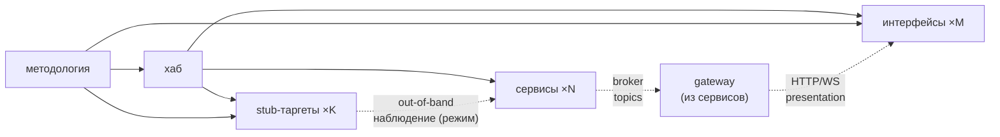

# Топология репозиториев (референс)

Программа — это **хаб + N сервисов + M интерфейсов + K stub-таргетов**, по
репозиторию на каждый. Этот репо — **методология** (центральный авторитет): он
читается, а инстанции (хаб/сервисы/интерфейсы/stub-таргеты) создаются копированием
`skeletons/`.

> Референс (факт «как устроена топология»). Процедуры — в `docs/guide/`,
> модель верификации рёбер — в `docs/refs/VERIFICATION.md`.

## Слои

| Слой | Репо | Несёт | Роль |
|---|---|---|---|
| **Методология** (этот репо) | один | `docs/guide/`, `docs/refs/`, `skeletons/`, корневые `README`/`AGENTS` | читается; скелеты копируются; корневой авторитет для гейта |
| **Хаб** | один | `COMPOSITION.md`, `CONVENTIONS.md`, системный `docker-compose.yml`, `adr/` | состав программы (сервисы + интерфейсы), кросс-сервисные контракты (event envelope), системный compose, ADR-дом |
| **Сервис** | по репо на сервис | `AGENTS.md`, `docs/{ARCHITECTURE,BACKLOG,specs/}`, `Dockerfile`, `docker-compose.yml` (локальный) | один микросервис; клиент брокера; **один из сервисов — `gateway` (каноническая роль: единственный browser-facing surface, экспонирует presentation-эндпоинты для интерфейсов); прочие сервисы presentation для интерфейсов не держат**; инстанциация из `skeletons/service/` |
| **Интерфейс** | по репо на интерфейс | `AGENTS.md`, `README.md`, `docs/ARCHITECTURE`, `.env.example` | React/TS-приложение; клиент на границе; визуализации; зовёт presentation-эндпоинты **gateway-сервиса**; инстанциация из `skeletons/interface/` |
| **Stub-таргет** | по репо на цель | `AGENTS.md`, `README.md`, `.env.example`, `docs/ARCHITECTURE`, (`Dockerfile`/`docker-compose.yml` — при `form=container`) | standalone-программа (форма — параметр дескриптора: контейнер / CLI / …), параметризуется дескриптором из manage; **не** брокер-клиент, **не** peer-сервис, без presentation-эндпоинтов. Out-of-band-наблюдение collector'ом — режим (включается, когда есть наблюдаемая поверхность), не свойство; инстанциация из `skeletons/stub/` |

## Что где живёт

- **Кросс-сервисные контракты** (event envelope, состав программы, системный
  compose, ADR) — в **хабе**, не в сервисах/интерфейсах.
- **Архитектура/бэклог/спеки одного сервиса** + его **presentation-эндпоинты** —
  в **сервис-репо** (`docs/ARCHITECTURE.md` → *Доверительная граница*).
- **Манифест потребления интерфейса** (какие эндпоинты gateway зовёт, страницы) —
  в **interface-репо** (`docs/ARCHITECTURE.md`). Интерфейс потребляет только
  gateway; presentation-эндпоинты для интерфейсов живут в `ARCHITECTURE`
  **gateway-сервиса**.
- **Архитектура stub-таргета** (форма, поверхности если наблюдаются,
  доверительная граница, деплой) — в **stub-репо** (`docs/ARCHITECTURE.md`).
  `MODULE.md`/`SPEC.md` к stub не применяются (он параметризуется дескриптором,
  не юзкейсами).
- **Процедуры и факты методологии** — в этом репо (`docs/guide/`, `docs/refs/`),
  читаются хабом/сервисами/интерфейсами/stub-таргетами централизованно, **не
  копируются**.
- **Стартовые файлы** — в `skeletons/{service,hub,interface,stub}/`.

## Правила

- Один репо = один сервис / один хаб / один интерфейс / один stub-таргет. Не
  смешивать. **gateway-сервис — это сервис** (инстанциация из `skeletons/service/`),
  не отдельный тип репо; его каноническая роль назначается в `COMPOSITION` хаба.
- **gateway-сервис** — единственный browser-facing surface: ровно один на
  систему, если есть хотя бы один интерфейс; только он держит presentation-эндпоинты
  для интерфейсов. Прочие сервисы browser-facing presentation не держат — их
  клиентский край = топики брокера, потребляемые gateway. Программа без интерфейсов
  gateway не требует.
- Сервис/интерфейс/stub-репо **не несёт** `docs/guide/`/`docs/refs/` — ссылается
  на этот репо методологии (см. `skeletons/{service,interface,stub}/AGENTS.md`).
- Прямая **service-to-service** связность в обход брокера (включая
  `gateway → сервис`) — запрещена (`docs/refs/COMMUNICATION.md`). **Интерфейс →
  gateway-сервис** — по HTTP/WS presentation-эндпоинтам (клиент на границе, не
  peer-сервис); gateway берёт данные прочих сервисов из брокера.
- **Stub-таргет** — standalone-программа, не участник брокера и не peer-сервис:
  не publish/consume топики, не имеет presentation-эндпоинтов, не зовёт чужие
  сервисы. Параметризуется дескриптором из manage (`form`: контейнер / CLI / …;
  `runtime_kind`). Out-of-band-наблюдение collector'ом — **режим**, не свойство:
  включается, когда у stub'а есть наблюдаемая поверхность (сеть/хост/процесс),
  мимо брокера; иначе stub — просто поставляемая standalone-программа без
  наблюдения. Деплой — по форме (контейнер — `Dockerfile`; CLI — артефакт/сборка).
- ADR — в хабе (`<hub>/adr/`); ссылки из сервисов, интерфейсов и stub-таргетов
  указывают туда. Хаб — единый ADR-дом программы (системные и сервисные решения).

## Edge-модель (верификация)

Гейт при изменении в узле проверяет все инцидентные рёбра (вверх —
соответствие авторитету, вниз — дочерние соответствуют ему). Полная edge-модель
— направления по узлам, версионирование контрактов для «вниз», conformance vs
behavioral — `docs/refs/VERIFICATION.md`. Список детей «вниз» — `COMPOSITION.md`
хаба (сервисы + интерфейсы + stub-таргеты).

**Почему сервисам — через хаб, интерфейсам и stub-таргетам — напрямую.** Канон
сервиса = versioned-контракт хаба (`CONVENTIONS@vN`): хаб — единственный
авторитет над сервисом, методология достигает его **транзитно** (прямого
`методология → сервис` нет). `gateway` — тоже сервис, поэтому хаб-опосредован
как любой сервис (`хаб → gateway`); его каноническая роль (browser-facing surface)
назначается в `COMPOSITION`. Канон интерфейса расщеплён по двум авторитетам:
репо-тип (React/TS, клиент на границе, без `MODULE`/`SPEC`) — из **методологии**
(прямое `методология → интерфейс`), реестр потребления — из **хаба**
(`хаб → интерфейс`, `COMPOSITION`). У интерфейса нет хаб-контракта аналогичного
`CONVENTIONS` — он зовёт presentation-эндпоинты **gateway-сервиса** (единственного
browser-facing surface), не брокер; поэтому единого хаб-посредника, как у
сервисов, нет и канон тянется напрямую. **Stub-таргет
аналогичен интерфейсу**: репо-тип (standalone-программа, без брокера/presentation, без
`MODULE`/`SPEC`) — из **методологии** (прямое `методология → stub`), реестр целей
— из **хаба** (`хаб → stub`, `COMPOSITION`). У stub нет хаб-контракта
(`CONVENTIONS@vN` N/A — он не потребляет envelope), поэтому канон тянется напрямую.
Out-of-band-наблюдение stub'а коллектором — не брокерное ребро, а операционный
факт (когда режим включён — collector сканирует/слушает поверхность stub'а);
фиксируется в `COMPOSITION`
хаба, не в `CONVENTIONS`.

## Инстанциация

- **Новый сервис:** скопируй `skeletons/service/` → новый репо → выбери стек
  (`docs/guide/00-bootstrap.md`) → заполни `ARCHITECTURE`/`BACKLOG`/`specs`. Если
  сервис назначается **gateway** — отметь роль в `COMPOSITION` хаба и держи
  presentation-эндпоинты для интерфейсов в `ARCHITECTURE` → *Доверительная граница*
  (это единственный browser-facing surface программы).
- **Новый интерфейс:** скопируй `skeletons/interface/` → новый репо → заполни
  `docs/ARCHITECTURE.md` (потребляемые эндпоинты **gateway-сервиса**, страницы) →
  `README`.
- **Новый stub-таргет:** скопируй `skeletons/stub/` → новый репо → выбери форму
  (`form`: контейнер / CLI / …) → заполни `docs/ARCHITECTURE.md` (форма, поверхности
  если наблюдаются, доверительная граница, деплой) → `README`. Брокера/presentation
  здесь нет.
- **Новый хаб:** скопируй `skeletons/hub/` → новый репо → заполни
  `COMPOSITION`/`CONVENTIONS` → добавь сервисы, интерфейсы и stub-таргеты по мере
  появления.