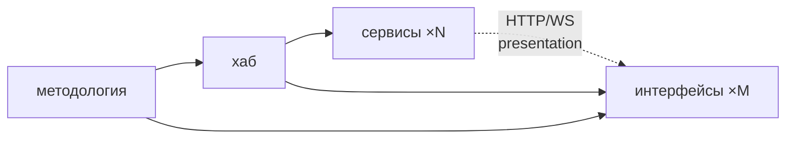

# Топология репозиториев (референс)

Программа — это **хаб + N сервисов + M интерфейсов**, по репозиторию на каждый.
Этот репо — **методология** (центральный авторитет): он читается, а инстанции
(хаб/сервисы/интерфейсы) создаются копированием `skeletons/`.

> Референс (факт «как устроена топология»). Процедуры — в `docs/guide/`,
> модель верификации рёбер — в `docs/refs/VERIFICATION.md`.

## Слои

| Слой | Репо | Несёт | Роль |
|---|---|---|---|
| **Методология** (этот репо) | один | `docs/guide/`, `docs/refs/`, `skeletons/`, корневые `README`/`AGENTS` | читается; скелеты копируются; корневой авторитет для гейта |
| **Хаб** | один | `COMPOSITION.md`, `CONVENTIONS.md`, системный `docker-compose.yml`, `adr/` | состав программы (сервисы + интерфейсы), кросс-сервисные контракты (event envelope), системный compose, ADR-дом |
| **Сервис** | по репо на сервис | `AGENTS.md`, `docs/{ARCHITECTURE,BACKLOG,specs/,adr/}`, `Dockerfile`, `docker-compose.yml` (локальный) | один микросервис; клиент брокера; экспонирует presentation-эндпоинты для интерфейсов; инстанциация из `skeletons/service/` |
| **Интерфейс** | по репо на интерфейс | `AGENTS.md`, `README.md`, `docs/{ARCHITECTURE,adr/}`, `.env.example` | React/TS-приложение; клиент на границе; визуализации; зовёт presentation-эндпоинты сервисов; инстанциация из `skeletons/interface/` |

## Что где живёт

- **Кросс-сервисные контракты** (event envelope, состав программы, системный
  compose, ADR) — в **хабе**, не в сервисах/интерфейсах.
- **Архитектура/бэклог/спеки одного сервиса** + его **presentation-эндпоинты** —
  в **сервис-репо** (`docs/ARCHITECTURE.md` → *Доверительная граница*).
- **Манифест потребления интерфейса** (какие сервисы/эндпоинты зовёт, страницы) —
  в **interface-репо** (`docs/ARCHITECTURE.md`).
- **Процедуры и факты методологии** — в этом репо (`docs/guide/`, `docs/refs/`),
  читаются хабом/сервисами/интерфейсами централизованно, **не копируются**.
- **Стартовые файлы** — в `skeletons/{service,hub,interface}/`.

## Правила

- Один репо = один сервис / один хаб / один интерфейс. Не смешивать.
- Сервис/интерфейс-репо **не несёт** `docs/guide/`/`docs/refs/` — ссылается на
  этот репо методологии (см. `skeletons/{service,interface}/AGENTS.md`).
- Прямая **service-to-service** связность в обход брокера — запрещена;
  **интерфейс → сервис** — по HTTP/WS presentation-эндпоинтам (клиент на
  границе), см. `docs/refs/COMMUNICATION.md`.
- ADR: для проекта с хабом — в хабе (`<hub>/adr/`); ссылки из сервисов и
  интерфейсов указывают туда. Standalone без хаба — `docs/adr/` в своём репо.

## Edge-модель (верификация)

Гейт при изменении в узле проверяет все инцидентные рёбра (вверх —
соответствие авторитету, вниз — все дочерние соответствуют ему). Рёбра:
- `методология → хаб`; `хаб → сервисы` (на пиннённой версии `CONVENTIONS@v<N>`);
- `методология → интерфейсы` (канон); `хаб → интерфейсы` (соответствие
  `COMPOSITION`: потребляет только существующие сервисы/эндпоинты);
- `сервис → интерфейс` (presentation-conformance, agent): заявленные
  интерфейсом вызовы соответствуют документированным эндпоинтам сервиса.

Список детей «вниз» — это `COMPOSITION.md` хаба (сервисы + интерфейсы). Полная
схема — `docs/refs/VERIFICATION.md`.

## Инстанциация

- **Новый сервис:** скопируй `skeletons/service/` → новый репо → выбери стек
  (`docs/guide/00-bootstrap.md`) → заполни `ARCHITECTURE`/`BACKLOG`/`specs`.
- **Новый интерфейс:** скопируй `skeletons/interface/` → новый репо → заполни
  `docs/ARCHITECTURE.md` (потребляемые эндпоинты, страницы) → `README`.
- **Новый хаб:** скопируй `skeletons/hub/` → новый репо → заполни
  `COMPOSITION`/`CONVENTIONS` → добавь сервисы и интерфейсы по мере появления.