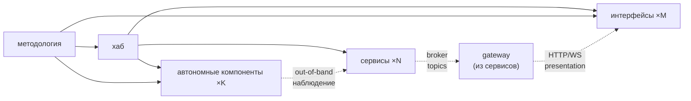

# Структура репозиториев — справочник

Система состоит из **хаба, сервисов, интерфейсов и автономных компонентов**, по
репозиторию на каждый. Этот репо — **методология** (центральный авторитет): он
читается, а экземпляры хаба, сервисов, интерфейсов и автономных компонентов создаются копированием
`skeletons/`.

> Референс (факт «как устроена топология»). Процедуры — в `docs/guide/`,
> модель верификации рёбер — в `docs/refs/VERIFICATION.md`.

## Слои

| Слой | Репо | Несёт | Роль |
|---|---|---|---|
| **Методология** (этот репо) | один | `docs/guide/`, `docs/refs/`, `skeletons/`, корневые `README`/`AGENTS` | читается; скелеты копируются; корневой авторитет для гейта |
| **Хаб** | один | `COMPOSITION.md`, `CONVENTIONS.md`, `BACKLOG.md` (программный бэклог), системный `docker-compose.yml`, `adr/` | состав программы (сервисы + интерфейсы), кросс-сервисные контракты (event envelope), **программный бэклог (что делать по всей программе)**, системный compose, ADR-дом |
| **Сервис** | один репозиторий на сервис | `AGENTS.md`, `docs/{ARCHITECTURE,specs/}`, `Dockerfile`, локальный `docker-compose.yml` | один микросервис и клиент брокера; один из сервисов может выполнять роль сервиса-шлюза; создаётся из `skeletons/service/` |
| **Интерфейс** | по репо на интерфейс | `AGENTS.md`, `README.md`, `docs/ARCHITECTURE`, `.env.example` | React/TS-приложение; клиент на границе; визуализации; зовёт presentation-эндпоинты **gateway-сервиса**; инстанциация из `skeletons/interface/` |
| **Автономный компонент** | один репозиторий на компонент | `AGENTS.md`, `README.md`, `.env.example`, `docs/ARCHITECTURE`; при `form=container` также `Dockerfile` и `docker-compose.yml` | отдельная программа вне брокерного обмена; создаётся из `skeletons/stub/` |

## Что где живёт

- **Кросс-сервисные контракты** (event envelope, состав программы, системный
  compose, ADR) и **программный бэклог** (что делать по всей программе) — в
  **хабе**, не в сервисах/интерфейсах. Бэклог один на всю программу, с
  глобальным локом (`<hub>/BACKLOG.md`, модель — `PIPELINE`).
- **Архитектура/спеки одного сервиса** + его **presentation-эндпоинты** —
  в **сервис-репо** (`docs/ARCHITECTURE.md` → *Доверительная граница*).
  Сервис своего `BACKLOG.md` не несёт — задачи берёт из хаба.
- **Манифест потребления интерфейса** (какие эндпоинты gateway зовёт, страницы) —
  в **interface-репо** (`docs/ARCHITECTURE.md`). Интерфейс потребляет только
  gateway; presentation-эндпоинты для интерфейсов живут в `ARCHITECTURE`
  **gateway-сервиса**.
- **Архитектура автономного компонента** (форма, способы взаимодействия,
  доверительная граница и развёртывание) — в его репозитории (`docs/ARCHITECTURE.md`).
  `MODULE.md`/`SPEC.md` к stub не применяются (он параметризуется дескриптором,
  не юзкейсами).
- **Процедуры и факты методологии** — в этом репо (`docs/guide/`, `docs/refs/`),
  читаются хабом, сервисами, интерфейсами и автономными компонентами централизованно, **не
  копируются**.
- **Стартовые файлы** — в `skeletons/{service,hub,interface,stub}/`.

## Правила

- Один репозиторий содержит один сервис, хаб, интерфейс или автономный компонент. Не
  смешивать. **gateway-сервис — это сервис** (инстанциация из `skeletons/service/`),
  не отдельный тип репо; его каноническая роль назначается в `COMPOSITION` хаба.
- **Сервис-шлюз** (`gateway`) — сервис со специальной ролью, указанной в `COMPOSITION`;
  ровно один, если есть ≥1 интерфейса). Модель —
  `docs/refs/COMMUNICATION.md` → *Сервис-шлюз*.
- Репозиторий сервиса, интерфейса или автономного компонента **не содержит** `docs/guide/` и `docs/refs/` — он ссылается
  на этот репо методологии (см. `skeletons/{service,interface,stub}/AGENTS.md`).
- Прямая **service-to-service** связность в обход брокера (включая
  `gateway → сервис`) — запрещена (`docs/refs/COMMUNICATION.md`). **Интерфейс →
  gateway-сервис** — по HTTP/WS presentation-эндпоинтам (клиент на границе, не
  peer-сервис); gateway берёт данные прочих сервисов из брокера.
- **Автономный компонент** — отдельная программа, не подключённая к
  брокеру и не являющаяся сервисом системы
  (без presentation, без потребления топиков; форма — контейнер/CLI/…; при
  наличии поверхности — out-of-band-наблюдение collector'ом). Модель и деплой по
  форме — `docs/refs/COMMUNICATION.md` → *Автономный компонент*.
- ADR находятся в хабе (`<hub>/adr/`); ссылки из сервисов, интерфейсов и автономных компонентов
  указывают туда. Хаб — единый ADR-дом программы (системные и сервисные решения).

## Модель проверяемых связей

Гейт при изменении в узле проверяет все инцидентные рёбра (вверх —
соответствие авторитету, вниз — дочерние соответствуют ему). Полная edge-модель
— направления по узлам, conformance vs behavioral —
`docs/refs/VERIFICATION.md`. Список детей «вниз» — `COMPOSITION.md`
хаба (сервисы, интерфейсы и автономные компоненты).

**Почему сервисы проверяются через хаб, а интерфейсы и автономные компоненты — напрямую.** Канон
сервиса = контракт хаба (`CONVENTIONS`): хаб — единственный
авторитет над сервисом, методология достигает его **транзитно** (прямого
`методология → сервис` нет). `gateway` — тоже сервис, поэтому хаб-опосредован
как любой сервис (`хаб → gateway`); его каноническая роль назначается в
`COMPOSITION`. Канон интерфейса расщеплён по двум авторитетам:
репо-тип (React/TS, клиент на границе, без `MODULE`/`SPEC`) — из **методологии**
(прямое `методология → интерфейс`), реестр потребления — из **хаба**
(`хаб → интерфейс`, `COMPOSITION`). У интерфейса нет хаб-контракта аналогичного
`CONVENTIONS` — он зовёт presentation-эндпоинты **gateway-сервиса**, не брокер
(см. `COMMUNICATION` → *Сервис-шлюз*); поэтому единого посредника в хабе, как у
сервисов, нет и канон применяется напрямую. **Автономный компонент
аналогичен интерфейсу** как отдельный тип репозитория без подключения к брокеру и без
`MODULE`/`SPEC`) — из **методологии** (прямое `методология → stub`), реестр целей
— из **хаба** (`хаб → stub`, `COMPOSITION`). У stub нет хаб-контракта
(он не потребляет envelope), поэтому канон тянется напрямую.
Out-of-band-наблюдение stub'а collector'ом — не брокерное ребро (stub про брокер
ничего не знает); фиксируется в `COMPOSITION` хаба, не в `CONVENTIONS`.

## Создание репозитория из шаблона

- **Новый сервис:** скопируй `skeletons/service/` → новый репо → выбери стек
  (`docs/guide/00-bootstrap.md`) → заполни `ARCHITECTURE`/`specs`. Если
  сервис назначается **gateway** — отметь роль в `COMPOSITION` хаба и держи
  presentation-эндпоинты для интерфейсов в `ARCHITECTURE` → *Доверительная граница*
  (модель — `COMMUNICATION` → *Сервис-шлюз*). Своего `BACKLOG` у сервиса нет —
  задачи берёт из `<hub>/BACKLOG.md`.
- **Новый интерфейс:** скопируй `skeletons/interface/` → новый репо → заполни
  `docs/ARCHITECTURE.md` (потребляемые эндпоинты **gateway-сервиса**, страницы) →
  `README`.
- **Новый автономный компонент:** скопируйте `skeletons/stub/` в новый репозиторий и выберите форму
  (`form`: контейнер / CLI / …) → заполни `docs/ARCHITECTURE.md` (форма, поверхности
  если наблюдаются, доверительная граница, деплой) → `README`. Брокера/presentation
  здесь нет.
- **Новый хаб:** скопируй `skeletons/hub/` → новый репо → заполни
  `COMPOSITION`/`CONVENTIONS`/`BACKLOG` → добавьте сервисы, интерфейсы и автономные компоненты
  по мере появления.
