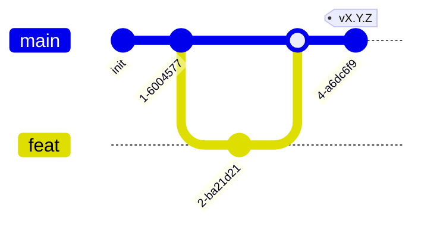

# AGENTS.md — правила работы в хаб-репозитории

Точка входа для людей и AI-агентов в **репозитории хаба**. Хаб хранит
системные контракты: `COMPOSITION.md` (состав программы), `CONVENTIONS.md`
(event envelope, кросс-сервисные конвенции), `BACKLOG.md` (программный
бэклог — единая очередь «что делать» по всей программе), системный
`docker-compose.yml`, `adr/`. Процедуры/факты методологии — в
`<methodology-repo>/docs/`.

> Хаб — родительский узел в edge-модели верификации: активно ребро **вниз**
> (`хаб → все сервисы`) — все сервисы проверяются на соответствие хабу. И ребро
> **вверх** (`методология → хаб`) — хаб соответствует методологии. См.
> `<methodology-repo>/docs/refs/VERIFICATION.md`.

## Документация (приоритет)

В порядке убывания **по ярусам**: методология (`<methodology-repo>/docs/`, где
`guide/` и `refs/` — **равные**, разные виды) → этот `AGENTS.md` →
`COMPOSITION.md` / `CONVENTIONS.md` / `BACKLOG.md` / `adr/` → код (если есть).

Приоритет арбитражирует **только между ярусами**. Противоречие **внутри яруса**
— **дефект** (чинят к одной правде либо ADR), а не «старший побеждает».

## Модель ветвления



- Прямой коммит в `main` — **запрещён**. Только feature-ветка + PR.
- Релизы — тегами `vX.Y.Z` на `main`; release-ветки не заводятся.
- **Программный бэклог** — `BACKLOG.md` в этом репо. Единственная очередь «что
  делать» по всей программе; строгая последовательность, глобальный лок
  (ровно один `[~]` in-flight). Агенты читают/правят его здесь — не в
  сервисах. Модель — `<methodology-repo>/docs/refs/PIPELINE.md`.

## Что можно

- Редактировать `COMPOSITION.md` (состав программы — добавлять/удалять
  сервисы и интерфейсы; секция «Интерфейсы» — для ребра `хаб → интерфейс`).
- Редактировать `CONVENTIONS.md` (event envelope, кросс-сервисные конвенции) —
  breaking change отдельным PR + апдейт сервисов под новый контракт.
- Редактировать `BACKLOG.md` (программный бэклог): человек — порядок/новые
  задачи/`needs-human`; агент — `[ ]`→`[~]`→`[x]` (маркер персистентен через
  коммит в хаб, `chore(backlog): …`).
- Менять системный `docker-compose.yml` (все сервисы + брокер).
- Заводить ADR в `adr/` (хаб — единый ADR-дом программы).
- Создавать feature-ветки, PR в `main`, теги.

## Что нельзя

- Коммитить напрямую в `main`; заводить `dev`/release-ветки.
- Хранить здесь код сервисов/интерфейсов или их рабочие артефакты
  (ARCHITECTURE/specs) — это в их репо. (Программный бэклог `BACKLOG.md`,
  напротив, живёт именно в хабе — это системный артефакт.)
- Вводить прямую **service-to-service** связность в обход брокера в
  `COMPOSITION`/`CONVENTIONS` — общение сервисов только через брокер
  (`<methodology-repo>/docs/refs/COMMUNICATION.md`). (Интерфейс → gateway-сервис
  по HTTP/WS — разрешено; это клиентский край, не service-to-service.)
- Держать **browser-facing presentation-эндпоинты** где-либо, кроме
  **gateway-сервиса** — только он их держит; ровно один, если есть ≥1 интерфейс
  (модель — `<methodology-repo>/docs/refs/COMMUNICATION.md` → *gateway-сервис*).

## Коммиты

Conventional Commits. Scope — `composition`/`conventions`/`deploy`/`docs`/`backlog`.

```
feat(conventions): add trace_id to event envelope
fix(composition): register new billing service
chore(backlog): mark 7 in-flight
docs: link ADR-0007 from COMPOSITION
```
docs: link ADR-0007 from COMPOSITION
```

Breaking changes контракта — `BREAKING CHANGE:` в теле.

## Язык

Документация — русский (или поменяй). Английский — для идентификаторов,
`Status:` в ADR, summary-строки коммита.