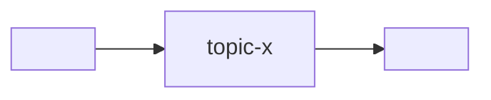

# Состав программы

Системный контекст микросервисной программы: какие сервисы входят, как
зависят, какой брокер, какой пин контрактов. Это **edge-реестр** для
verification «вниз» (хаб → все сервисы): гейт перечисляет сервисы отсюда.

> Скелет. Заполни под программу. Методология — в `<methodology-repo>/docs/`;
> общение микросервисов — `<methodology-repo>/docs/refs/COMMUNICATION.md`.

## Брокер

- **Брокер:** <Kafka | Redpanda | NATS>   <!-- один на систему -->
- **Адрес (система):** из `docker-compose.yml`, сервис `broker`.

## Сервисы

| Сервис | Репо | Роль | Публикует / Читает | Пин контракта |
|---|---|---|---|---|
| `<service-a>` | <repo-url> | … | publish: `…` / consume: `…` | `CONVENTIONS@v1` |
| `<service-b>` | <repo-url> | … | … | `CONVENTIONS@v1` |

## Зависимости (DAG)

<!-- Потоки между сервисами через брокер. Прямых связей в обход брокера нет. -->

## Версии контрактов

| Версия | Статус | Что |
|---|---|---|
| `CONVENTIONS@v1` | supported | начальный envelope |
| `CONVENTIONS@v2` | — | <!-- planned breaking: trace_id, … --> |

Правила версионирования — `AGENTS.md` → *Версионирование контрактов*;
почему пин обязателен — `<methodology-repo>/docs/refs/VERIFICATION.md`.

## ADR

Значимые решения — в `adr/`. Ссылки из этого файла и из `CONVENTIONS.md`.

- `adr/0001-record-architecture-decisions.md` — заводим ADR (мета).
- <!-- добавляй по мере -->