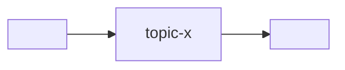

# Состав программы

Системный контекст микросервисной программы: какие сервисы и интерфейсы
входят, как зависят, какой брокер, какой пин контрактов. Это **edge-реестр**
для verification «вниз» (хаб → все сервисы + хаб → все интерфейсы): гейт
перечисляет детей отсюда.

> Скелет. Заполни под программу. Методология — в `<methodology-repo>/docs/`;
> общение микросервисов — `<methodology-repo>/docs/refs/COMMUNICATION.md`.

## Брокер

- **Брокер:** <Kafka | Redpanda | NATS>   <!-- один на систему -->
- **Адрес (система):** из `docker-compose.yml`, сервис `broker`.

## Сервисы

> **gateway-сервис** — один из сервисов, с канонической ролью: единственный
> browser-facing surface программы (экспонирует presentation-эндпоинты для
> интерфейсов; потребляет топики прочих сервисов, публикует command-топики).
> Ровно один, если в программе есть хотя бы один интерфейс; помечай роль в
> колонке «Роль» (напр. `gateway`). Прочие сервисы presentation для интерфейсов
> не держат. Модель — `<methodology-repo>/docs/refs/COMMUNICATION.md` →
> *gateway-сервис*.

| Сервис | Репо | Роль | Публикует / Читает | Пин контракта |
|---|---|---|---|---|
| `<gateway>` | <repo-url> | **gateway** (browser-facing) | consume: `…` / publish: `…` | `CONVENTIONS@v1` |
| `<service-a>` | <repo-url> | … | publish: `…` / consume: `…` | `CONVENTIONS@v1` |
| `<service-b>` | <repo-url> | … | … | `CONVENTIONS@v1` |

## Интерфейсы

> Интерфейсы — клиенты на границе, не сервисы и не брокер-клиенты. Зовут
> presentation-эндпоинты **gateway-сервиса** (см. `ARCHITECTURE` gateway; один
> URL/CORS/auth). Здесь — реестр для ребра `хаб → интерфейс` (потребляет только
> существующие эндпоинты gateway).

| Интерфейс | Репо | Визуализирует | Потребляет (gateway/эндпоинт) |
|---|---|---|---|
| `<interface-a>` | <repo-url> | … | `<gateway> /v1/...` |

## Зависимости (DAG)

<!-- Потоки между сервисами через брокер. Прямых связей в обход брокера нет. -->

## Версии контрактов

| Версия | Статус | Что |
|---|---|---|
| `CONVENTIONS@v1` | supported | начальный envelope |
| `CONVENTIONS@v2` | — | <!-- planned breaking: trace_id, … --> |

Правила версионирования — `AGENTS.md` → *Версионирование контрактов*;
почему пин обязателен — `<methodology-repo>/docs/refs/VERIFICATION.md`.

## ADR

Значимые решения — в `adr/`. Ссылки из этого файла и из `CONVENTIONS.md`.

- `adr/0001-record-architecture-decisions.md` — заводим ADR (мета).
- <!-- добавляй по мере -->