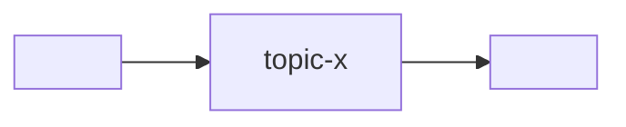

# Состав программы

Системный контекст микросервисной программы: какие сервисы и интерфейсы
входят, как зависят, какой брокер. Это **edge-реестр** для verification «вниз»
(хаб → все сервисы + хаб → все интерфейсы): гейт перечисляет детей отсюда.

> Скелет. Заполни под программу. Методология — в `<methodology-repo>/docs/`;
> коммуникация — `<methodology-repo>/docs/ARCHITECTURE.md`.

## Брокер

- **Брокер:** <Kafka | Redpanda | NATS>   <!-- один на систему -->
- **Адрес (система):** из `docker-compose.yml`, сервис `broker`.

## Сервисы

> **Сервис-шлюз** (`gateway`) — один из сервисов со специальной ролью; укажите её в
> колонке «Роль» (напр. `gateway`). Ровно один, если в программе есть хотя бы один
> интерфейс. Модель — `<methodology-repo>/docs/ARCHITECTURE.md` →
> *Сервис-шлюз*.

| Сервис | Репо | Роль | Публикует / Читает |
|---|---|---|---|
| `<gateway>` | <repo-url> | **gateway** (browser-facing) | consume: `…` / publish: `…` |
| `<service-a>` | <repo-url> | … | publish: `…` / consume: `…` |
| `<service-b>` | <repo-url> | … | … |

## Интерфейсы

> Интерфейсы — клиенты на границе, не сервисы и не брокер-клиенты. Зовут
> presentation-эндпоинты **gateway-сервиса** (см. `ARCHITECTURE` gateway; один
> URL/CORS/auth). Здесь — реестр для ребра `хаб → интерфейс` (потребляет только
> существующие эндпоинты gateway).

| Интерфейс | Репо | Визуализирует | Потребляет (gateway/эндпоинт) |
|---|---|---|---|
| `<interface-a>` | <repo-url> | … | `<gateway> /v1/...` |

## Зависимости (DAG)

<!-- Потоки между сервисами через брокер. Прямых связей в обход брокера нет. -->

## ADR

Значимые решения — в `adr/`. Ссылки из этого файла и из `CONVENTIONS.md`.

- `adr/0001-record-architecture-decisions.md` — заводим ADR (мета).
- <!-- добавляй по мере -->
