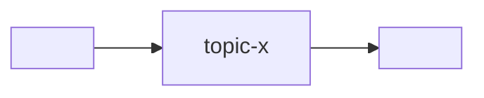

# Состав программы

Количество репозиториев, назначение каждого и высокоуровневые границы определяет
человек. Агент обновляет этот реестр только по явно принятому человеком решению.

Системный контекст программы: какие сервисы, интерфейсы и автономные компоненты
входят, как зависят, какой брокер. Это **реестр связей** для проверки «вниз»
(хаб → каждый зарегистрированный репозиторий): обязательная проверка перечисляет дочерние репозитории отсюда.

> Скелет. Заполни под программу. Методология — в `<methodology-repo>/docs/`;
> коммуникация — `<methodology-repo>/docs/ARCHITECTURE.md`.

## Брокер

- **Брокер:** <Kafka | Redpanda | NATS>   <!-- один на систему -->
- **Адрес (система):** из `docker-compose.yml`, сервис `broker`.

## Сервисы

> **Сервис-шлюз** (`gateway`) — один из сервисов со специальной ролью; укажите её в
> колонке «Роль» (напр. `gateway`). Ровно один, если в программе есть хотя бы один
> интерфейс. Модель — `<methodology-repo>/docs/ARCHITECTURE.md` →
> *Сервис-шлюз*.

| Сервис | Репозиторий | Версия/хеш | Роль | Публикует / Читает |
|---|---|---|---|---|
| `<gateway>` | `<repo-url>` | `<version-or-hash>` | **сервис-шлюз** (`gateway`, клиентский API) | читает: `…` / публикует: `…` |
| `<service-a>` | `<repo-url>` | `<version-or-hash>` | … | публикует: `…` / читает: `…` |
| `<service-b>` | `<repo-url>` | `<version-or-hash>` | … | … |

## Интерфейсы

> Интерфейсы — клиенты на границе, не сервисы и не брокер-клиенты. Зовут
> маршруты клиентского API **сервиса-шлюза** (см. `ARCHITECTURE` сервиса-шлюза; один
> URL/CORS/auth). Здесь — реестр для ребра `хаб → интерфейс` (потребляет только
> существующие маршруты сервиса-шлюза).

| Интерфейс | Репозиторий | Версия/хеш | Визуализирует | Потребляет (сервис-шлюз/маршрут) |
|---|---|---|---|---|
| `<interface-a>` | `<repo-url>` | `<version-or-hash>` | … | `<gateway> /v1/...` |

## Автономные компоненты

> Независимо поставляемые программы вне сервисного обмена. Они не подключаются к
> брокеру; наблюдаемые поверхности контролируются отдельным каналом. Если таких
> компонентов нет, явно укажите «нет».

| Компонент | Репозиторий | Версия/хеш | Форма | Назначение / поверхности |
|---|---|---|---|---|
| `<standalone-component>` | `<repo-url>` | `<version-or-hash>` | `container` / `cli` / … | … |

## Зависимости (DAG)

<!-- Потоки между сервисами только через брокер. Прямых связей нет. -->

## ADR

Значимые решения — в `adr/`. Ссылки из этого файла и из `CONVENTIONS.md`.

- `adr/0001-record-architecture-decisions.md` — заводим ADR (мета).
- <!-- добавляй по мере -->
