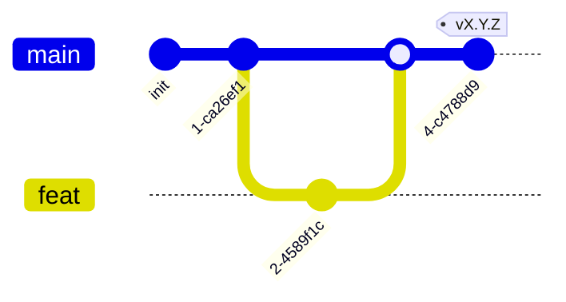

# AGENTS.md — правила работы в интерфейс-репозитории

Точка входа для людей и AI-агентов в **репозитории одного интерфейса**
(React/TS-приложение для визуализаций общего проекта). Здесь только **правила**
(ветвление, что можно/нельзя, коммиты, язык, стек-команды) и указатели.
Процедуры — в методологии (`<methodology-repo>/docs/guide/`), факты — в
`<methodology-repo>/docs/refs/`. Начни с `<methodology-repo>/docs/INDEX.md`.

> Это репо **одного интерфейса** (инстанциация из `skeletons/interface/`
> методологии). Интерфейс — **клиент на доверительной границе**, не
> брокер-клиент и не peer-сервис. Зовёт **presentation-эндпоинты сервисов**
> по HTTP/WS, документированные в их `ARCHITECTURE.md` → *Доверительная
> граница* (модель — `<methodology-repo>/docs/refs/COMMUNICATION.md` →
> *Клиентский край*). Стек — фиксированный React/TS
> (`<methodology-repo>/docs/refs/STACKS.md` → *frontend*).
>
> Системный контекст (состав программы, список сервисов/интерфейсов, event
> envelope) — в **хабе** `COMPOSITION.md`; топология —
> `<methodology-repo>/docs/refs/TOPOLOGY.md`.

## Документация (приоритет)

В порядке убывания **по ярусам**: хаб → этот `AGENTS.md` →
методология (`<methodology-repo>/docs/guide/` и `/docs/refs/` — **равные**,
разные виды) → `docs/ARCHITECTURE.md` → код.

`<methodology-repo>/docs/INDEX.md` — роутер. Приоритет арбитражирует
**только между ярусами**. Противоречие **внутри яруса** (в т.ч. `guide/` против
`refs/`) — **дефект**, а не «старший побеждает»: чинят к одной правде либо
фиксируют в ADR (`<methodology-repo>/docs/guide/60-adr.md`).

## Модель ветвления



- `main` — стабильная, единственная интеграция. Вливается из feature-веток через PR.
- `feat/<задача>` — от `main`, удаляется после merge.
- Прямой коммит в `main` — **запрещён**. Только feature-ветка + PR.
- Релизы — тегами `vX.Y.Z` (semver) на `main`; release-ветки не заводятся
  (`<methodology-repo>/docs/guide/70-release.md`).

## Стек (фиксированный)

React + TypeScript (Vite, `pnpm`, ESLint, vitest). Полная конфигурация —
`<methodology-repo>/docs/refs/STACKS.md` → *TypeScript (frontend / interface)*.
Прогон перед коммитом — `<methodology-repo>/docs/guide/40-verify.md`.

| lint | test | build |
|---|---|---|
| `pnpm lint && tsc --noEmit` | `pnpm test` | `pnpm build` |

## Указатели на процедуры/факты (в методологии)

- Войти в проект (интерфейс) — заполни `README` и `docs/ARCHITECTURE.md`
  (потребляемые эндпоинты, страницы); стек-команды — выше.
- Presentation-эндпоинты сервисов — в их `ARCHITECTURE` → *Доверительная
  граница*; модель клиентского края —
  `<methodology-repo>/docs/refs/COMMUNICATION.md`.
- Проверить перед коммитом — `<methodology-repo>/docs/guide/40-verify.md`;
  теория — `<methodology-repo>/docs/refs/VERIFICATION.md` (инвариант #15 —
  соответствие заявленных вызовов эндпоинтам сервисов, agent).
- Деплой (статика) — `<methodology-repo>/docs/refs/DEPLOYMENT.md` → *Интерфейс*.
- Записать ADR — `<methodology-repo>/docs/guide/60-adr.md`.
- Выпустить версию (тег) — `<methodology-repo>/docs/guide/70-release.md`.

## Что можно

- Писать React/TS-код интерфейса (компоненты/страницы/хуки/сторы).
- Менять `docs/ARCHITECTURE.md` (манифест потребления: сервисы/эндпоинты,
  страницы/роуты) — это то, что сверяет гейт.
- Менять конфигурацию сборки/манифесты с обоснованием.
- Создавать feature-ветки, PR в `main`, теги `vX.Y.Z`.

## Что нельзя

- Коммитить напрямую в `main`; заводить `dev`/release-ветки.
- Отклоняться от манифеста потребления в `docs/ARCHITECTURE.md` — заявленные
  вызовы должны соответствовать реальным presentation-эндпоинтам сервисов
  (гейт-agent #15; отклонение через ADR, не тихим отступлением).
- Быть брокер-клиентом или peer-сервисом — интерфейс зовёт только
  presentation-эндпоинты; прямая связность с чужой БД/брокером запрещена.
- Применять к интерфейсу `MODULE.md`/`SPEC.md` — это бэкенд-канон сервиса.
- Смешивать стеки (интерфейс — только React/TS).
- Добавлять зависимости без обоснования; выдавать stub за реализацию.
- Трогать `pnpm-lock.yaml`, `.env`, `dist/` без одобрения.

## Коммиты

Conventional Commits. Scope — `ui`/`page`/`api`/`docs`/`deploy`.

```
feat(ui): add invoice timeline chart
fix(api): pin billing /v1/invoices endpoint
docs: document consumed endpoints in ARCHITECTURE
```

Breaking changes (смена потребляемого эндпоинта/версии) — `BREAKING CHANGE:` в
теле. Язык — `AGENTS.md` → *Язык* ниже.

## Язык

Документация — русский (или поменяй под проект). Английский — только для
идентификаторов кода, имён модулей/страниц, `Status:` в ADR, summary-строки
коммита.