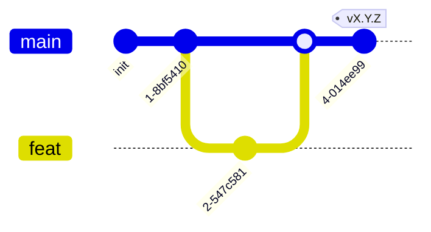

# AGENTS.md — правила работы в сервис-репозитории

Точка входа для людей и AI-агентов в **репозитории одного сервиса**. Здесь
только **правила** (ветвление, что можно/нельзя, коммиты, язык, команды стека)
и указатели. Процедуры — в методологии (`<methodology-repo>/docs/guide/`),
факты — в `<methodology-repo>/docs/refs/`. Начни с
`<methodology-repo>/docs/INDEX.md`.

> Это репо **одного микросервиса** (инстанциация из `skeletons/service/`
> методологии). Внутри — workspace из модулей, у каждого своя спека. Сервис
> реализуется **на одном из стеков**: Python, Go, Rust, TypeScript. Правило:
> один сервис — один язык. Сервис — клиент **брокера** (одного на систему;
> Kafka/Redpanda/NATS) и деплоится **контейнером** со своим `Dockerfile`.
>
> Системный контекст (состав программы, event envelope, системный compose,
> ADR) — в **хабе**; топология репозиториев —
> `<methodology-repo>/docs/refs/TOPOLOGY.md`, общение микросервисов —
> `<methodology-repo>/docs/refs/COMMUNICATION.md`.

## Документация (приоритет)

В порядке убывания **по ярусам**: хаб → этот `AGENTS.md` →
методология (`<methodology-repo>/docs/guide/` и `/docs/refs/` — **равные**,
разные виды) → рабочие артефакты (`docs/ARCHITECTURE.md`, `docs/specs/`) → код.

`<methodology-repo>/docs/INDEX.md` — роутер методологии. Приоритет
арбитражирует **только между ярусами**. Противоречие **внутри яруса** (в т.ч.
`guide/` против `refs/`) — **дефект**, а не «старший побеждает»: чинят к одной
правде либо фиксируют в ADR (`<methodology-repo>/docs/guide/60-adr.md`).

## Модель ветвления



- `main` — стабильная, единственная интеграция. Вливается из feature-веток через PR.
- `feat/<задача>` — от `main`, удаляется после merge.
- Прямой коммит в `main` — **запрещён**. Только feature-ветка + PR.
- **Ревью и merge — агент, не человек.** Ревьюер — независимый вызов агента;
  человек в pre-deploy-цикле не участвует. Merge в `main` — по зелёному гейту,
  без человеческого одобрения. Два касания человека: **(1)** пишет программный
  бэклог в хабе (`<hub>/BACKLOG.md` — единая очередь «что делать» по всей
  программе; сервис своего `BACKLOG.md` **не** несёт), **(2)** разбирает баг из
  тест/прода → задача в `<hub>/BACKLOG.md`. Полная модель —
  `<methodology-repo>/docs/refs/PIPELINE.md`.
- Релизы — тегами `vX.Y.Z` (semver) на `main`; release-ветки не заводятся
  (`<methodology-repo>/docs/guide/70-release.md`). В автономном цикле rc режется
  автоматически после merge.

Процедура работы — `<methodology-repo>/docs/guide/30-implement-task.md`.

## Команды проверки (выбранный стек)

Стек выбирается один раз для всего репо. **Заполни одну строку**, удали
остальные. Полная конфигурация toolchain'а —
`<methodology-repo>/docs/refs/STACKS.md`. Прогон перед коммитом —
`<methodology-repo>/docs/guide/40-verify.md`.

| Стек | lint | test | build |
|---|---|---|---|
| **Python** | `ruff format --check . && ruff check . && pyright` | `pytest` | `uv build` |
| **Go** | `gofmt -l . && go vet ./...` | `go test ./...` | `go build -o bin/<service> ./cmd/<service>` |
| **Rust** | `cargo fmt --check && cargo clippy -- -D warnings` | `cargo test` | `cargo build --release` |
| **TypeScript** | `pnpm lint && tsc --noEmit` | `pnpm test` | `pnpm build` |

> Go: `gofmt -l .` должен вывести пустоту. Python: типы — `pyright`.
> TypeScript: runtime — Node 24+ (только он); менеджер — `pnpm` (только он).

## Указатели на процедуры (в методологии)

- Войти в проект — `<methodology-repo>/docs/guide/00-bootstrap.md`.
- Описать архитектуру — `<methodology-repo>/docs/guide/10-architecture.md`.
- Добавить модуль / спеку — `<methodology-repo>/docs/guide/20-define-module.md`.
- Внутренняя архитектура модуля (usecases/ports/domain/adapters) —
  `<methodology-repo>/docs/refs/MODULE.md`.
- Взять задачу, реализовать — `<methodology-repo>/docs/guide/30-implement-task.md`.
- Проверить перед коммитом — `<methodology-repo>/docs/guide/40-verify.md`;
  теория — `<methodology-repo>/docs/refs/VERIFICATION.md`.
- Запустить локально — `<methodology-repo>/docs/guide/50-deploy.md`;
  структура compose/Dockerfile — `<methodology-repo>/docs/refs/DEPLOYMENT.md`.
- Записать ADR — `<methodology-repo>/docs/guide/60-adr.md`.
- Выпустить версию (тег) — `<methodology-repo>/docs/guide/70-release.md`.
- Автономный цикл (без человека в pre-deploy) —
  `<methodology-repo>/docs/refs/PIPELINE.md`.
- Роли агентов (разработчик/тестировщик/ревьюер/безопасник) —
  `<methodology-repo>/docs/refs/ROLES.md`.

## Что можно

- Писать код в модулях сервиса (workspace) и (опц.) `shared/`.
- Менять конфигурацию сборки/манифесты с обоснованием.
- Менять `Dockerfile`, корневой `docker-compose.yml` (локальная разработка:
  брокер + сервис), `.env.example` с обоснованием.
- Обновлять `docs/` (рабочие артефакты: `ARCHITECTURE`/`specs`). ADR — в хабе.
  Бэклог — в хабе (`<hub>/BACKLOG.md`), не в этом репо.
- Создавать feature-ветки, коммитить, пушить, открывать PR в `main`.
- Заводить новые модули в workspace'е (со спекой — `guide/20`).

## Что нельзя

- Коммитить напрямую в `main`.
- Заводить `dev`/release-ветки — интеграция через PR в `main`, версии — тегами.
- Смешивать стеки (один сервис — один язык).
- Вводить системный multi-service compose или кросс-сервисные контракты в этом
  репо — это зона хаба (`<methodology-repo>/docs/refs/TOPOLOGY.md`).
- Прямую **service-to-service** связность в обход брокера
  (`<methodology-repo>/docs/refs/COMMUNICATION.md`). **Browser-facing
  presentation-эндпоинты (HTTP/WS) для интерфейсов — только у gateway-сервиса**
  и документируются в `docs/ARCHITECTURE.md` → *Доверительная граница* (модель —
  `<methodology-repo>/docs/refs/COMMUNICATION.md` → *Сервис-шлюз*). Обычные
  сервисы их **не** держат — клиентский край через топики, потребляемые gateway.
- Создавать ADR вне хаба (`<hub>/adr/`; процедура — `guide/60`).
- Отклоняться от usecase-структуры модуля
  (`<methodology-repo>/docs/refs/MODULE.md`) — отклонение через ADR в хабе
  (`<hub>/adr/`; процедура — `guide/60`), не тихим отступлением.
- Добавлять зависимости (включая образы в compose) без обоснования.
- Выдавать stub за реализацию — честно помечать placeholder/TODO.
- Трогать lock-файлы, `.env`, артефакты сборки без одобрения.

## Коммиты

Conventional Commits. Полностью на английском (или на языке проекта — *Язык*).

```
feat(<module>): add zfs-snapshot fs probe
fix(<module>): reject path traversal in HostBridge
docs: update ARCHITECTURE.md with module matrix
refactor(<module>): extract envelope signing
chore(deploy): pin redpanda image in compose
```

Scope — имя модуля или `deploy`/`docs`. Breaking changes — `BREAKING CHANGE:` в теле.

## Язык

Документация — русский (или поменяй под проект). Английский допустим только для
идентификаторов кода, имён модулей, `Status:` в ADR, summary-строки коммита.
