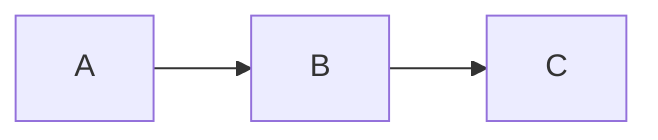
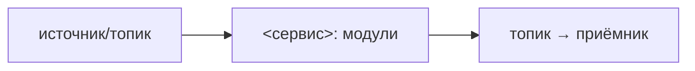

# Архитектура

> Скелет одного микросервиса. Стек — `<methodology-repo>/docs/refs/STACKS.md`,
> раскладка workspace'а — `<methodology-repo>/docs/refs/LAYOUT.md`, деплой —
> `<methodology-repo>/docs/guide/50-deploy.md` + `<methodology-repo>/docs/refs/DEPLOYMENT.md`.
> Процедура заполнения — `<methodology-repo>/docs/guide/10-architecture.md`. Заполни
> секции под свой сервис. Структура секций читается и людьми, и агентами.
>
> Состав программы (несколько сервисов, системная топология) — в хабе
> `COMPOSITION.md`. Здесь — только этот сервис и его граница с системой.

## Что это

<!-- 1–2 предложения: что за сервис, какую роль в программе играет.
     Ссылка на хаб COMPOSITION.md для системного контекста. -->

## Что делает

<!-- Нумерованный список ключевых функций сервиса. -->

1. **<Глагол>** — кратко что делает и зачем.

## Чего не делает

<!-- Явные границы. Важно для агентов, чтобы не «помогали» там, где не надо. -->

- Не делает …

## Модули

<!-- Таблица модулей сервиса. Каждый модуль представлен каталогом по структуре
     выбранного стека и отдельной спецификацией. -->

| Модуль | Роль | Публикует / Читает (топики) |
|---|---|---|
| `<module-a>` | … | publish: `…` / consume: `…` |
| `<module-b>` | … | … |
| `<module-c>` | … | … |

Зависимости между модулями (DAG):

## Брокер

<!-- Один брокер на систему (Kafka / Redpanda / NATS — зафиксируй). Сервис —
     его клиент. Формат сообщений — из хаба CONVENTIONS.md, не свой. -->

- **Брокер:** <Kafka | Redpanda | NATS>
- **Адрес (локальная разработка):** из `docker-compose.yml`, сервис `broker`.
- **Контракты хаба:** `CONVENTIONS` — текущий контракт хаба, по которому гейт
  проверяет сервис (см. `<methodology-repo>/docs/refs/COMMUNICATION.md`, процедура — `<methodology-repo>/docs/guide/40-verify.md`).

Топики сервиса:

| Топик | Направление | Назначение |
|---|---|---|
| `<topic>` | publish / consume | … |

Формат и конверт сообщения определены в `CONVENTIONS.md` хаба.

## Потоки данных

<!-- Потоки этого сервиса через брокер (входящие/исходящие). -->

### <Поток 1: имя>

<!-- Шаги потока с объяснением. -->

## Доверительная граница

<!-- Где проходит граница доверия сервиса, что по какую сторону, гарантии,
     подпись/аутентификация если есть. Для сервисов без границ — секцию убрать.

     РАЗЛИЧАЙ роль сервиса:
     • Если это **сервис-шлюз** (ровно один на систему при наличии
       пользовательских интерфейсов), здесь же описывается клиентский API для
       интерфейсов — путь, метод, версия, формат ответа. Интерфейсы зовут только их
       (модель — <methodology-repo>/docs/refs/COMMUNICATION.md → «gateway-сервис» /
       «Клиентский край»); гейт-agent #14 сверяет заявленные интерфейсом вызовы с
       этой таблицей.
     • Обычный сервис не предоставляет клиентский API. Пользовательский
       интерфейс получает его данные через сервис-шлюз, который читает
       топики (см. *Брокер* выше). Секцию границы заполняй про
       брокерное/аутентификацию сервиса. -->

<!-- Только для сервиса-шлюза: -->

- Клиентский API сервиса-шлюза:

  | Эндпоинт | Метод | Версия | Формат ответа | Назначение |
  |---|---|---|---|---|
  | `/v1/<endpoint>` | GET / WS | v1 | JSON | … |

- …

## Деплой

- Сервис — контейнер со своим `Dockerfile`; локальная разработка —
  `docker-compose.yml` (брокер + этот сервис). Детали —
  `<methodology-repo>/docs/refs/DEPLOYMENT.md`, запуск — `<methodology-repo>/docs/guide/50-deploy.md`.
- Системный compose (все сервисы вместе) — в хабе, не здесь.
- Соответствие текущим соглашениям хаба проверяется контрольным рубежом
  (`<methodology-repo>/docs/refs/VERIFICATION.md`, процедура — `<methodology-repo>/docs/guide/40-verify.md`).

## Ссылки

- Хаб `COMPOSITION.md` — состав программы.
- Хаб `CONVENTIONS.md` — event envelope, кросс-сервисные конвенции.
- Хаб `adr/` — архитектурные решения программы.
