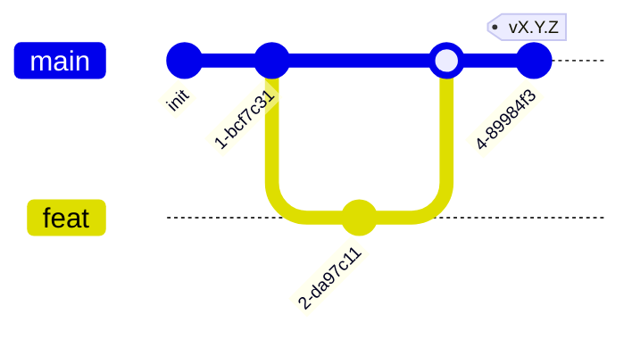

# AGENTS.md — правила работы в stub-репозитории

Точка входа для людей и AI-агентов в **репозитории одного stub-таргета**
(passive target: deployed-контейнер, реальный сокет + параметризованный
баннер/поведение, наблюдается out-of-band; не симулятор и не брокер-клиент).
Здесь только **правила** (ветвление, что можно/нельзя, коммиты, язык, стек-команды)
и указатели. Процедуры — в методологии (`<methodology-repo>/docs/guide/`), факты —
в `<methodology-repo>/docs/refs/`. Начни с `<methodology-repo>/docs/INDEX.md`.

> Это репо **одного stub-таргета** (инстанциация из `skeletons/stub/` методологии).
> Stub — **не участник брокера** и **не peer-сервис**: не publish/consume топики,
> не имеет presentation-эндпоинтов (HTTP/WS для интерфейсов). Это пассивная цель —
> контейнер, выставляющий реальные сетевые поверхности (raw TCP/SSH/HTTP-баннер и
> т.п.), параметризуемый дескриптором из control-plane (manage). Наблюдается
> collector'ом out-of-band. Деплой — **контейнером** со своим `Dockerfile`.
> `MODULE.md`/`SPEC.md` к stub **не применяются** (бэкенд-канон usecase-швов для
> сервиса); stub параметризуется дескриптором, а не юзкейсами.
>
> Системный контекст (состав программы, список сервисов/интерфейсов/stub-таргетов,
> event envelope) — в **хабе** `COMPOSITION.md`; топология —
> `<methodology-repo>/docs/refs/TOPOLOGY.md`.

## Документация (приоритет)

В порядке убывания **по ярусам**: хаб → этот `AGENTS.md` →
методология (`<methodology-repo>/docs/guide/` и `/docs/refs/` — **равные**,
разные виды) → `docs/ARCHITECTURE.md` → код.

`<methodology-repo>/docs/INDEX.md` — роутер. Приоритет арбитражирует
**только между ярусами**. Противоречие **внутри яруса** (в т.ч. `guide/` против
`refs/`) — **дефект**, а не «старший побеждает»: чинят к одной правде **до
коммита** (гейт-agent #11 блокирует; см.
`<methodology-repo>/docs/refs/VERIFICATION.md`) либо фиксируют в ADR
(`<methodology-repo>/docs/guide/60-adr.md`).

## Модель ветвления



- `main` — стабильная, единственная интеграция. Вливается из feature-веток через PR.
- `feat/<задача>` — от `main`, удаляется после merge.
- Прямой коммит в `main` — **запрещён**. Только feature-ветка + PR.
- Релизы — тегами `vX.Y.Z` (semver) на `main`; release-ветки не заводятся
  (`<methodology-repo>/docs/guide/70-release.md`).

## Стек

Stub реализуется на одном из бэкенд-стеков (Python/Go/Rust/TypeScript) — выбор
один раз для всего репо. Полная конфигурация toolchain'а —
`<methodology-repo>/docs/refs/STACKS.md`. Прогон перед коммитом —
`<methodology-repo>/docs/guide/40-verify.md`. **Заполни одну строку** стека, удали
остальные (как в сервисе).

| Стек | lint | test | build |
|---|---|---|---|
| **Python** | `ruff format --check . && ruff check .` | `pytest` | `uv build` |
| **Go** | `gofmt -l . && go vet ./...` | `go test ./...` | `go build -o bin/<stub> ./cmd/<stub>` |
| **Rust** | `cargo fmt --check && cargo clippy -- -D warnings` | `cargo test` | `cargo build --release` |
| **TypeScript** | `pnpm lint && tsc --noEmit` | `pnpm test` | `pnpm build` |

> Stub может не иметь классических юзкейсов/тестов (параметризуется дескриптором);
> тогда `test` честно помечается отсутствующим (placeholder/TODO — инвариант #10),
> а `lint`/`build` обязаны идти (контейнер должен собираться).

## Указатели на процедуры/факты (в методологии)

- Войти в проект (stub) — заполни `README` и `docs/ARCHITECTURE.md` (роль passive
  target, поверхности, доверительная граница, деплой); стек-команды — выше.
- Проверить перед коммитом — `<methodology-repo>/docs/guide/40-verify.md`;
  теория и применимость инвариантов для stub —
  `<methodology-repo>/docs/refs/VERIFICATION.md`.
- Деплой (контейнер-цель) — `<methodology-repo>/docs/refs/DEPLOYMENT.md`
  (структура compose/Dockerfile/env — как у сервиса, но без брокера).
- Записать ADR — `<methodology-repo>/docs/guide/60-adr.md` (ADR — в хабе).
- Выпустить версию (тег) — `<methodology-repo>/docs/guide/70-release.md`.

## Что можно

- Писать код stub-таргета (поверхности/баннеры/поведение, параметризуемые
  дескриптором) и его конфигурацию.
- Менять `Dockerfile`, корневой `docker-compose.yml` (локальная разработка:
  этот stub-контейнер, **без брокера**), `.env.example`/конфиг-дескриптор с
  обоснованием.
- Обновлять `docs/ARCHITECTURE.md` (роль passive target, поверхности, доверительная
  граница, деплой).
- Создавать feature-ветки, PR в `main`, теги `vX.Y.Z`.

## Что нельзя

- Коммитить напрямую в `main`; заводить `dev`/release-ветки.
- Быть **брокер-клиентом** или **peer-сервисом** — stub не publish/consume топики,
  не имеет presentation-эндпоинтов; не лезет в чужую БД/брокер. Наблюдается
  collector'ом out-of-band, сам ничего не зовёт.
- Применять к stub `MODULE.md`/`SPEC.md`/`BACKLOG.md`/`docs/specs/` — это
  бэкенд-канон сервиса; stub параметризуется дескриптором, а не юзкейсами. (Если
  у stub есть осмысленные модули — описывают в `docs/ARCHITECTURE.md`, не в спеках.)
- Смешивать стеки (один stub — один язык).
- Создавать ADR вне хаба (`<hub>/adr/`; процедура — `guide/60`).
- Добавлять зависимости (включая образы в compose) без обоснования.
- Выдавать stub/заглушку за реализацию — честно помечать placeholder/TODO (#10).
- Трогать lock-файлы, `.env`, артефакты сборки без одобрения.

## Коммиты

Conventional Commits. Scope — `surface`/`banner`/`deploy`/`docs`/имя модуля.

```
feat(banner): add SSH banner emulation for lite-target
fix(surface): reject malformed handshake
chore(deploy): pin stub base image in Dockerfile
```

Breaking changes — `BREAKING CHANGE:` в теле. Язык — `AGENTS.md` → *Язык* ниже.

## Язык

Документация — русский (или поменяй под проект). Английский допустим только для
идентификаторов кода, имён модулей/поверхностей, `Status:` в ADR, summary-строки
коммита.